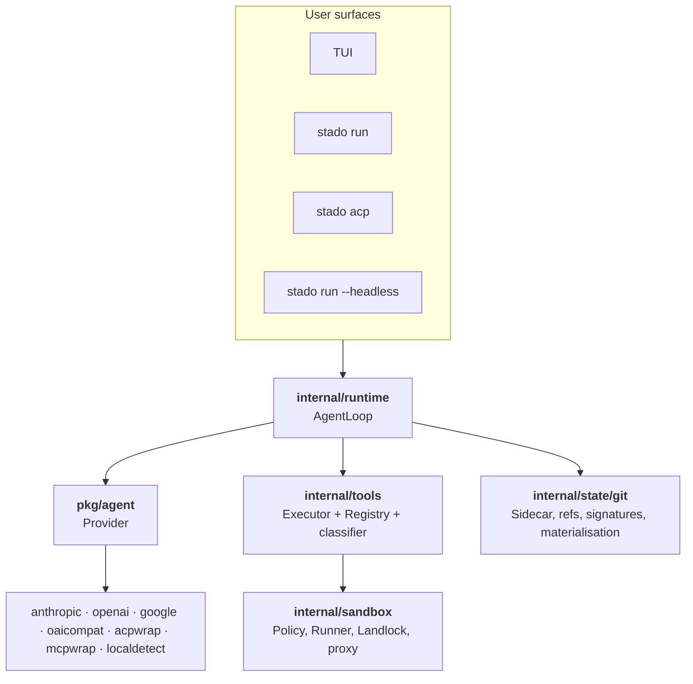
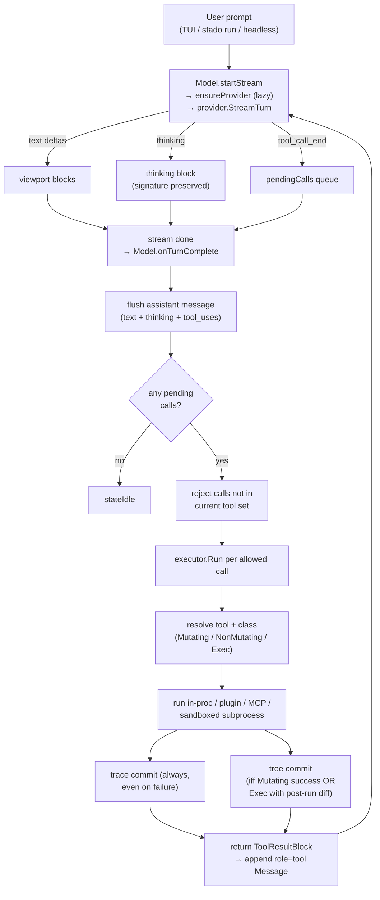

# stado — Design

Companion to [`PLAN.md`](PLAN.md). PLAN is the phased roadmap + intent;
DESIGN is the concise as-built reference. When something contradicts,
PLAN describes where we're going, DESIGN describes where we are.

---

## One-paragraph description

stado is a sandboxed, git-native coding-agent runtime. A thin
provider interface (`pkg/agent`) fronts four direct LLM integrations
(Anthropic, OpenAI, Google, and a hand-rolled OpenAI-compatible client
that covers ollama/llama.cpp/vLLM/groq/openrouter/…). The agent loop
owns a git sidecar repository per user repo; every tool call the model
makes is committed to a per-session `trace` ref (audit log) and — if
mutating — to a `tree` ref (executable history). Signatures on every
commit make the refs tamper-evident. The TUI, `stado run`, the ACP
server (for Zed), and the JSON-RPC headless daemon all compose the same
agent-loop core; `stado mcp-server` reuses the same tool/runtime stack
to expose stado itself as an MCP v1 tool server.

---

## Component map



> The diagram predates the v1 **broker** (§"Broker"), which landed in
> v0.57.0 and now sits as a privileged process boundary between the user
> surfaces and `internal/runtime` — every interactive surface attaches to
> it by default. The mermaid above does not yet show that node.

- **Provider interface**: one streaming method (`StreamTurn`) emitting a
  discriminated `Event` type. Opaque `Native` fields preserve
  provider-specific payloads (thinking signatures, reasoning content) so
  round-trips don't lose state.
- **Agent loop** (`runtime.AgentLoop`): turn-based — stream, collect
  tool calls, execute via `Executor`, append `role=tool` message, next
  turn, repeat until no tool calls. Bounded by `MaxTurns`.
- **Executor**: looks up tool by name, classifies (Mutating / NonMutating
  / Exec), runs it, writes trace commit always, tree commit conditionally.
  Metrics recorded via OTel instruments.
- **Sidecar**: one bare repo per user repo at
  `$XDG_DATA_HOME/stado/sessions/<repo-id>.git`, alternates-linked to the
  user's `.git/objects`. Zero object duplication.
- **Worktree**: per-session directory at
  `$XDG_STATE_HOME/stado/worktrees/<session-id>/` — plain file tree,
  materialised from and back to sidecar tree objects via
  `BuildTreeFromDir` / `MaterializeTreeToDir`.

---

## Request path: single user prompt → streamed turn



---

## Provider interface (`pkg/agent`)

```go
type Provider interface {
    Name() string
    Capabilities() Capabilities
    StreamTurn(ctx, TurnRequest) (<-chan Event, error)
}
```

**Messages** are lists of typed `Block`s (Text / ToolUse / ToolResult /
Image / Thinking). Exactly one pointer field per block. Ordering
matters — assistant messages often interleave text, thinking, and
tool_use blocks, and providers (especially Anthropic) reject rearranged
sequences.

**Events** are a discriminated union via `EventKind`:
`EvTextDelta · EvThinkingDelta · EvToolCallStart · EvToolCallArgsDelta
· EvToolCallEnd · EvCacheHit · EvCacheMiss · EvUsage · EvDone · EvError`.

**Capabilities** surface what a model supports — `SupportsPromptCache`,
`SupportsThinking`, `MaxParallelToolCalls`, `SupportsVision`,
`MaxContextTokens`. The agent loop branches on these today for prompt
caching, thinking enablement/budgeting, vision gating, and context
threshold enforcement.

`EvCacheHit` / `EvCacheMiss` and `Usage.CacheReadTokens` /
`CacheWriteTokens` are the *intended* canonical surface for prompt-cache
telemetry; §"Context management" defines the invariants around what may
appear in the cached prefix and how the hit/miss counts feed OTel metrics.
As-built caveat (do not over-read this section): the discrete `EvCacheHit`
/ `EvCacheMiss` *events* are part of the `Event` union but are **not
currently emitted by the core providers** — cache accounting flows through
the `Usage.CacheReadTokens` / `CacheWriteTokens` fields where a provider
reports them. The OTel instruments these would feed
(`stado_cache_hit_ratio` etc.) are declared in `internal/telemetry` but
are **not yet wired to recording call sites** (see EP-0011). Likewise
`MaxParallelToolCalls` is reported by providers but the agent loop runs
tool calls sequentially today and does not yet read it.

---

## Git-native state (`internal/state/git`)

### Refs

| Ref | What | Commit policy |
|---|---|---|
| `refs/sessions/<id>/tree` | executable history + boundary markers | mutating OR exec-with-diff OR no-file-change turn/compaction marker |
| `refs/sessions/<id>/trace` | audit log | every tool call (empty tree) |
| `refs/sessions/<id>/turns/<n>` | turn boundary tag | tagged via `Session.NextTurn` |

### Commit message format

```
<tool>(<short-arg>): <summary>

Tool: write
Args-SHA: sha256:…
Result-SHA: sha256:…
Tokens-In: 1234
Tokens-Out: 567
Cache-Hit: true
Cost-USD: 0.0012
Model: claude-sonnet-4-5
Duration-Ms: 342
Agent: stado-tui
Turn: 3
Signature: ed25519:<base64>
```

Machine-parseable trailers; the `Signature` trailer is generated by
signing canonical bytes `stado-audit-v1\ntree <hash>\nparent <p1>\n…\n\n<body>` (body = message with any preexisting Signature
trailer stripped). Tampering with any of the covered fields invalidates
the signature — `stado audit verify` walks a ref and reports the first
invalid commit.

### Fork semantics

`stado session fork <parent-id>`:

1. Create child session id.
2. Resolve parent's tree-ref head (may be zero if parent never committed).
3. Seed child's tree-ref at the parent's head hash.
4. Materialise parent's tree into child's worktree.

The trace ref is NOT shared — it's session-local, an audit record of
that particular agent's actions.

`stado session revert <id> <commit-or-turns/N>` is the same mechanism
but rooted at an earlier point in history; produces a new child session,
leaves the parent untouched.

The user-facing contract for "forking from an earlier point" — the
two required paths (`session fork --at` and `session tree`), the
turn-reference syntax, and the promise that the parent is never
modified — is specified in §"Fork-from-point ergonomics" under
§"Context management".

---

## Sessions and sub-agents

Sessions are stado's unit of **agent-bearing** execution and the
security atom of the runtime. **One agent per session.** When the
agent loop needs an isolated agent — a sub-agent dispatched to
explore a tangent, a compaction worker that summarises a long
history, an auto-compaction plugin recovering a context overflow —
it forks a child session rather than re-entering the parent. The
child has its own forked worktree, conversation log, trace ref,
turn boundary, and capability set; the parent is not modified.

`stado tool run` is **not** a session: it executes a single named
WASM plugin under the plugin's declared capabilities with no LLM,
no provider, no message history, and no fork ancestry. The broker
still mediates the sandbox construction for these calls — see
§"Broker" → "Non-session sandbox requests" — but no `trace` ref
is opened and no session ID is allocated.

### Capability ceiling and effective set

Each session has two associated capability descriptions:

- A **ceiling**: the maximal set of capabilities the session is ever
  permitted to hold. The ceiling is immutable for the life of the
  session. It is derived at session-creation time from the operator's
  global policy and the declared purpose of the session (see §"Broker"
  for who derives it and how).
- An **effective set**: the capabilities the session currently holds.
  The effective set sits at or below the ceiling. It may *narrow*
  during the session — capabilities can be voluntarily dropped — but
  it may never widen in place. Drop-only.

**Widening a session is forbidden.** A request to gain capabilities
a session does not have — for example, "add an additional folder to
my write scope" or "extend my egress hosts" — is realised by forking
a new session with a wider ceiling, not by mutating the running one.
Forking and re-warming the prompt cache is the deliberate cost of
gaining privilege; dropping privilege is free and may be automatic.

**Capabilities attenuate down the spawn tree.** A child session's
ceiling is validated against the operator's global policy at the
broker and projected from the child's declared purpose. A child may
be (and usually is) strictly weaker than its parent; it can never
exceed what the global policy allows. **Invariant: capability never
escalates along the spawn tree.**

### The spawn_agent surface

The first-class tool for parent-initiated sub-agents surfaces to the model
as `agent__spawn` (the native `spawn_agent` registration was removed in the
all-tools-as-wasm refactor; `spawn_agent` survives only as the runtime
concept name). Its arguments declare the child's purpose and the ceiling it
should be projected to:

| Field | Meaning |
|---|---|
| `prompt` | The single task the child is being spawned to do. |
| `role` | `explorer` (read-only investigator) or `worker` (write-permitted contributor). |
| `mode` | `read_only` (no filesystem writes) or `workspace_write` (writes confined to a declared scope). |
| `write_scope` | When `mode = workspace_write`, the relative paths the child is permitted to write under. |
| `max_turns` | Hard cap on the child's agent-loop turns. Defaults to 6; runtime cap is 12. |
| `timeout_seconds` | Wall-clock cap on the child's run. Defaults to 180 s; runtime cap is 900 s. |
| `persona` | Optional override of the operating manual the child runs under. Empty inherits the parent's active persona; `default` selects the bundled default. |

The child's ceiling is **mechanically projected** from these fields
— a `role: explorer, mode: read_only` child gets a read-only
filesystem ceiling regardless of what the parent had; a `role:
worker, mode: workspace_write` child with a declared `write_scope`
gets writes exactly to that scope. The projection is the mechanism;
the model does not negotiate ceilings, it declares purposes that
map to them.

Children run **synchronously** from the parent's tool call: the
parent session is not re-entered until the child completes, fails,
or hits its budget. The result returned to the parent model
includes `status`, `child_session`, the child's `worktree`, the
resulting `fork_tree` SHA when changes were produced, the list of
`changed_files`, any `scope_violations` the substrate observed,
and an `adoption_command` the operator can run to fold the work
back.

### Adoption

`stado session adopt <parent-id> <child-id> --apply` applies the
child's changes into the parent's worktree and records
`subagent_adopt` trace and tree commits on the parent. The act of
adopting is itself an audited event; the parent's `tree` ref
retains the full history of what was adopted and from whom. A
dry-run form (omit `--apply`) summarises the proposed adoption
without mutating the parent.

`/subagents` in the TUI lists the most recent child sessions with
their status, worktree, changed-file counts, scope violations, and
the per-child `adoption_command`. Headless surfaces emit
`session.update { kind: "subagent" }` notifications with the same
fields.

### Invariants

- **One agent per session.** Sub-agents always fork; the parent
  session is never multiplexed.
- **The ceiling is immutable; the effective set is drop-only.**
  Widening requires forking a new session.
- **Capability never escalates along the spawn tree.** A child can
  be weaker than its parent, never stronger.
- **The parent's history is never edited by the child.** Adoption
  appends commits to the parent; it does not rewrite parent turns.
  The append-only invariant from §"Context management" applies
  across the parent/child boundary.
- **Scope violations surface in the result.** A `worker` whose
  attempted writes fell outside its declared `write_scope` returns
  the offending paths in `scope_violations`; the parent model and
  the operator both see the failure.
- **Budgets are substrate-enforced.** `max_turns` and
  `timeout_seconds` are not advisory: when either is exceeded the
  child is terminated by the runtime regardless of what it's doing.

### Git sub-agent

Git and related tooling (`go get`, `npm install`, `pip install`,
build hooks, lifecycle scripts) need authentication to happen and
need network egress to fetch — but they do not need the agent
process to be able to read private-key bytes. v1 separates key
**material** from key **use**.

**Key material never enters the agent's namespace.** Private key
files (`~/.ssh/id_*`, `*.pem`, and equivalents) are not mounted
into any session's sandbox in either profile (see §"Sandbox" mount
table). The agent cannot `cat` an SSH private key because the
file is not reachable from inside its namespace.

**The ssh-agent runs outside the sandbox.** Only its socket is
bind-mounted into the sandbox of a session that has the
ssh-agent capability, with `SSH_AUTH_SOCK` set. The sandboxed
agent can request signatures over the socket; it cannot extract
the key. The capability to hold this socket is what the rest of
the section is about.

#### The main chat session never holds the socket

The session the operator converses with — the main TUI / `stado
run` / headless chat session — **never** has the ssh-agent
capability. Network git operations require a dedicated sub-agent
session; the main session cannot perform them directly.

#### The git sub-agent flow

To do network git, the main session issues a `spawn_agent`
request whose declared purpose is network git on a specified set
of hosts. The broker:

1. Reads the declared task — which hosts, which keys, which kind
   of operation (fetch / clone / similar).
2. Projects a **ceiling** that is mechanically derived from the
   declared task:
   - The ssh-agent the sub-agent receives contains *only the
     key(s) for the declared host(s)*. A request to clone from
     `github.com` does not get a sub-agent with the operator's
     work GitLab key loaded.
   - Egress (network-namespace level) is scoped to the declared
     hosts and the package sources required to resolve them
     (e.g. proxy hosts for transitive resolution). Other egress
     is denied at the namespace floor.
   - Worktree access is minimal: the bare amount needed to write
     the build outputs the operation produces. Operator secrets,
     dotfiles, and credential paths are not mounted.
3. Validates the projected ceiling against the operator's global
   policy.
4. Constructs the sub-agent session and mounts the socket.

"A git sub-agent" in the abstract is **not** acceptable scope; the
declared task — hosts, keys, operation — *is* the ceiling. The
broker refuses an open-ended sub-agent grant.

#### Fetch, not push

The grant is **fetch-oriented**. Package installs, module
downloads, and `git clone` / `git fetch` need read auth, not push.
The intended end-state composes two layers:

- **ssh-agent** makes the key unstealable from inside the
  namespace.
- **Tool dispatch** makes `git push` (or equivalent) unreachable
  from a fetch-purposed session.

**As-built status (not yet the end-state):** the tool-dispatch
`git push` deny is *infrastructure-only* today — `IsForbiddenForGitSubagent`
(internal/broker) exists but is **not wired into tool dispatch**, and the
ssh-agent socket bind-mount / per-host key filtering are deferred to a later
phase. The current implementation forwards the main-session ssh-agent socket
(decision 2026-06-13) — the key is never written to disk, but a
prompt-injected agent can still sign git operations. Treat the two-layer
description above as the target design, not a shipped control.

#### The sub-agent IS also stado's arbitrary-network-code execution

The socket-bearing sub-agent is the same session that runs
package-install lifecycle scripts, cgo, build hooks — code
authored by whoever owns the package the operator just asked to
fetch. This is not a coincidence; it is the design. The session
that talks to the network to fetch code is the same session that
executes that code. It therefore receives the **strictest fence
in the system**, not a relaxed one: minimal worktree access for
build outputs, no secrets paths mounted, scoped egress, scoped
ssh-agent contents.

#### Termination is broker-owned

The sub-agent session is **short-lived** and **terminated by the
broker** on a deterministic condition:

- The declared tool sequence completes.
- The wall-clock budget (`timeout_seconds`) is exceeded.
- The turn budget (`max_turns`) is exceeded.

On termination the broker revokes the grant: unmounts the
ssh-agent socket, tears down the netns, releases the worktree.
The agent does not get a vote on its own teardown — there is no
"can I just have a bit longer" path. The grant window is **the
task, not the session's convenience**.

#### Approval

Granting a socket-bearing git sub-agent requires user approval
**once per sub-agent session**. The session being single-purpose
and broker-terminated is what makes "once" a meaningful unit —
the operator approves a specific declared task, not an open-ended
grant.

The approval prompt is an **audit anchor** and a **speed bump**.
It is **not** the containment boundary. The approval prompt's
input is a justification produced by a possibly-compromised
agent, and a justification string is socially engineerable — a
sufficiently convincing prompt-injection can make the wrong
request *look* right. **Containment is the mechanically
projected ceiling**: scoped keys, scoped egress, fetch-not-push
at dispatch, broker teardown. The approval gates honest
mistakes and raises attacker cost; only the projected
capability set actually contains.

Whether the approval prompt **fires** is gated on the **taint
state** of the requesting context (see §"Context management" →
"Provenance and taint"):

- A request made from a **clean** context (no UNTRUSTED span has
  entered since the last operator turn) may be granted without
  prompting. This preserves the no-nag default for ordinary
  flows.
- A request made from a **tainted** context **must prompt**.
  An untrusted-context request for network git is the
  lethal-trifecta shape forming, and is exactly the moment a
  human decision is worth the interruption.

#### HTTPS-git is a known limitation

Token-based HTTPS git authentication (the bearer secret in
`~/.git-credentials`, the `gh` CLI's stored token, `GITHUB_TOKEN`
in the environment) has **no signing-oracle equivalent**. The
token *is* the credential — any process that can use it can read
it. v1 does **not** solve HTTPS-git credential confinement. The
honest position: ssh remotes are the path v1 makes confinable;
HTTPS remotes carry a bearer token whose use is its read. An
operator who needs network git for a host that only supports
HTTPS can either:

- Switch the remote to ssh (and rely on this section's
  protections).
- Run with `--no-sandbox` for that specific operation,
  accepting the documented loss of containment.
- Wait for a future phase that addresses HTTPS-credential
  confinement separately.

The default ship does not silently expose `~/.git-credentials`
or `GITHUB_TOKEN` to the main session. An operator who wants
HTTPS git available accepts the trade-off explicitly.

Cross-refs (Git sub-agent): §"Broker" (the validator that
projects the ceiling); §"Sandbox" → "Mount-and-namespace
invariant table" (the rows for `~/.ssh/`, `SSH_AUTH_SOCK`,
`known_hosts`, and the `~/.ssh/config` decision point); §"Context
management" → "Provenance and taint" (the gating signal for the
approval prompt).

Cross-refs (section): §"Broker" (who validates capability
requests and constructs the session); §"Sandbox" (the OS-level
fence that enforces the effective set); §"Git-native state" →
"Fork semantics" (the storage layer the spawn forks on top of);
§"Context management" → "Plugin extension points for context
management" (the plugin-initiated session-fork capability for
context-management plugins).

---

## Tool runtime (`internal/tools`)

### Tool interface

```go
type Tool interface {
    Name() string
    Description() string
    Schema() map[string]any       // JSON Schema for the model
    Run(ctx, args json.RawMessage, h Host) (Result, error)
}

// Optional — tools that want explicit mutation class.
type Classifier interface { Class() Class }
```

`Host` is the read-write surface tools use to reach the runtime.
`PriorRead` / `RecordRead` are the extensions required by §"Context
management" → "In-turn deduplication".

```go
type Host interface {
    Approve(ctx, ApprovalRequest) (Decision, error)
    Workdir() string
    PriorRead(key ReadKey) (PriorReadInfo, bool)
    RecordRead(key ReadKey, info PriorReadInfo)
}

// ReadKey identifies a read for deduplication.
type ReadKey struct {
    Path  string
    Range string
}

// PriorReadInfo is what Host.PriorRead hands back on a match.
type PriorReadInfo struct {
    Turn        int    // 1-indexed turn number when the prior read occurred
    ContentHash string // sha256 of the bytes returned to the model in that turn
}
```

`Host.PriorRead` returns the MOST RECENT prior read when multiple
exist. Implementations live in the TUI and headless surfaces and
delegate to a session-scoped read log maintained by the Executor.
Both the `ReadKey` input and `PriorReadInfo` output are structs so
future fields (hash algorithm, compression marker, …) don't force
signature churn.

`RecordRead` is the symmetric write side of `PriorRead`. Only the
`read` tool calls it; this is a convention enforced by documentation,
not by the interface itself. Other tools (`ripgrep`, `bash`, …) must
not call `RecordRead` even when they incidentally read files. The
Executor's in-memory log is the sole consumer; there is no
persistence.

**Return-value contract for `PriorRead`.** On `ok=true`, all fields of
`PriorReadInfo` must be populated (non-zero `Turn`, non-empty
`ContentHash`). On `ok=false`, callers must treat the returned
`PriorReadInfo` as undefined and inspect only `ok`. Future fields
added to `PriorReadInfo` follow the same rule — populated on success,
undefined on failure.

The `read` tool computes the content hash incrementally while reading
(via `io.MultiWriter` into both the output buffer and a `sha256.New()`
hasher), not as a post-read pass. Hash scope is the **targeted region
only**, not the full file for ranged reads — a range request + range
match is independent of bytes outside the range. One pass over the
bytes, one hash.

`ReadKey.Range` is a canonical form produced by the read tool: `""`
for a full-file read, `"<start>:<end>"` for a ranged read (both
inclusive, 1-indexed to match the tool's user-facing args). The read
tool is responsible for resolving any alternative input shapes into
this canonical form before constructing the `ReadKey`. Tests must
assert canonicalization for each input shape the tool accepts. (The read
tool's user-facing args are now byte `offset`/`length` with `LINE#HASH`
line-anchored output — see §"Bundled tools"; the 1-indexed `<start>:<end>`
form here is the in-turn dedup key, not the current input schema.)

### Bundled tools

All model-facing tools are WASM-backed bundled plugins (EP-0002,
EP-0037/0038) — the native in-process tool registrations were removed. They
register under wire-form names (`fs__read`, `shell__bash`, …); a small core
is auto-loaded each turn and the rest are reachable through the dispatch
meta-tools. A representative slice (the full surface also includes the
`shell__*` PTY tools, `agent__*` sub-agent tools, `dns__resolve`, and
`session__search`):

| Tool | Class | Notes |
|---|---|---|
| `fs__read` | NonMutating | args: `{path, offset?, length?}` (byte offsets). Default output prefixes each line `LINE#HASH:` (1-indexed line + 2-char content hash); copy those anchors into the `fs__edit` `pos`/`end`. `offset`/`length` give a raw partial byte read (no prefixes). |
| `fs__write` | Mutating | |
| `fs__edit` | Mutating | hash-anchored `{op, pos, end, lines}` edits validated against the read anchors |
| `fs__glob` | NonMutating | |
| `fs__grep` | NonMutating | simple Go substring |
| `rg__search` | NonMutating | ripgrep `--json` |
| `astgrep__search` | NonMutating | `ast-grep run --json` |
| `shell__bash` | Exec | snapshot → run → diff |
| `web__fetch` | NonMutating | HTTP GET |
| `readctx__read` | NonMutating | Go-aware import resolution |
| `lsp__definition` | NonMutating | LSP textDocument/definition |
| `lsp__references` | NonMutating | LSP textDocument/references |
| `lsp__symbols` | NonMutating | LSP textDocument/documentSymbol |
| `lsp__hover` | NonMutating | LSP textDocument/hover |
| *(MCP servers)* | varies | auto-registered from `[mcp.servers]` in **user config only** (stripped from project `.stado/config.toml`, EP-0044) |

### Executor invariants

Per call, unconditionally:
1. classify → `Mutating | NonMutating | Exec`
2. time the call
3. `Registry.Get(name).Run(ctx, args, host)`
4. record `stado_tool_latency_ms`
5. build `CommitMeta` trailers

Then:
- **trace ref**: always committed (even on failure; `Error:` trailer).
- **tree ref**: committed iff `Mutating` (success) OR `Exec` AND
  post-run tree hash differs from pre-run tree hash. Session turn
  boundaries and accepted compactions may also add metadata commits with
  the same tree hash so pure chat sessions remain forkable/auditable.

---

## Context management

Four separate concerns that must not be conflated: (1) prompt-cache
efficiency, (2) context-window overflow handling, (3) compaction, (4)
tool-output curation. Each has a different answer, and the answers
sometimes trade against each other.

**Philosophy.** Curation and caching are primary. Overflow handling is a
safety net. In-place compaction is explicit and user-confirmed. Automatic
recovery is allowed only through plugin-driven child-session forks, as
with the bundled `auto-compact` background plugin; the parent session is
not silently rewritten. When a session becomes unwieldy, the preferred
manual recovery is fork-from-an-earlier-point into a fresh session (see
§"Fork semantics"), not lossy in-place summarization.

### Prompt-cache awareness

The turn prefix (system prompt + tool definitions + any session-static
header) is treated as a **stable byte-identical artefact** across
successive turns. Cache breakpoints — where the provider supports
explicit ones, as with Anthropic's `cache_control: ephemeral` via
`agent.TurnRequest.CacheHints` — are placed at the end of this prefix.

Rules, enforced at the code level:

- **Append-only history.** The agent loop never rewrites prior turns
  in place. `Model.msgs` / `runtime.AgentLoop`'s message slice grows
  monotonically within a session. Any transformation that would edit a
  prior message invalidates every downstream cache entry and is
  therefore forbidden.
- **Deterministic tool serialization.** `TurnRequest.Tools` must emit
  tools sorted by name. Map iteration order is banned from any code
  path that produces prompt bytes. Applies equally to the wire
  serialisation inside provider packages (tool-call ids, JSON field
  order).
- **No dynamic content in the prefix.** Timestamps, per-run UUIDs,
  token counters, random nonces, wall-clock clocks — none may appear
  inside the cached bytes. The test below is the gate: the rendered
  prefix for identical inputs must be byte-identical.
- **Cache telemetry round-trips through the provider seam.** The
  existing `EvCacheHit` / `EvCacheMiss` events on `pkg/agent.Event`,
  plus `Usage.CacheReadTokens` / `CacheWriteTokens`, are the canonical
  way providers surface hit/miss. These feed the `stado_cache_hit_ratio`
  histogram defined in the telemetry spec.

Cross-refs: §"Provider interface" (events + usage fields);
[EP-0011](docs/eps/0011-observability-and-telemetry.md)
(`stado_cache_hit_ratio`).

### Token accounting

Token counts come from provider-native usage when available, with
client-side estimates used before the provider responds and for
OpenAI-compatible backends that do not expose a richer counter.
Per-backend:

| Backend | Tokenizer |
|---|---|
| Anthropic | `Messages.CountTokens` pre-flight, or the official tokenizer |
| OpenAI + OAI-compat | `tiktoken` or server-reported usage when available |
| Google / Gemini | genai SDK tokenizer |

When a provider cannot report a usable `MaxContextTokens`, stado keeps
the session usable and hides/skips threshold enforcement rather than
presenting a misleading percentage.

Two configurable thresholds, expressed as percentages of the active
model's `Capabilities.MaxContextTokens` (percentages, not absolute —
context windows vary wildly):

- **Soft (default 70%).** TUI shows a dismissable warning indicator;
  headless emits a `session.update { kind: "context_warning",
  level: "soft" }` notification. Recommendation is to fork. No
  automatic action.
- **Hard (default 90%).** In the TUI, the next turn first attempts
  bundled `auto-compact` recovery by forking a compacted child session
  and replaying the blocked prompt there. If no child appears, the
  prompt remains in the editor and the user recovers manually with
  `/compact`, `session tree`, or `session fork --at`. Headless emits
  `session.update { kind: "context_warning", level: "hard" }` and
  leaves blocking/recovery policy to the client.

### Tool-output curation

Every tool declares a default output-size budget. In the shipped code,
these are enforced as byte, match, or entry caps; for text-heavy tools
the byte limits are chosen as rough approximations of token budgets.
Defaults:

| Tool | Default budget | Notes |
|---|---|---|
| `read` | 16 KiB | Roughly 4K tokens; `start` / `end` request specific regions |
| `ripgrep` | first 100 matches | truncation marker appended |
| `grep` | first 100 matches | same |
| `bash` | 32 KiB combined stdout+stderr | Roughly 8K tokens; head + tail preserved; middle elided |
| `glob` | 200 entries | |
| `webfetch` | 16 KiB | Roughly 4K tokens |

Truncation is **visible to the model** — truncated output carries an
explicit marker so the model knows to request more:

```
[truncated: 14823 of 15000 lines elided — call with range=... for more]
```

The override is per-call via tool arguments, never a global config
knob. The model, not the user, decides when full output is warranted.

**In-turn deduplication (SHOULD).** The tool layer should detect when
a `read` call targets a path+range already read earlier in the current
session and return a reference response in the *current* turn's
`tool_result` rather than re-reading from disk. The prior turn is not
modified — its `tool_result` bytes remain unchanged, so the prompt
cache stays valid. The current turn's `tool_result` carries the
reference; the model learns of the duplicate from the new turn's
payload.

Reference responses include the canonical range in the citation — e.g.
`"already read lines 10:20 at turn 5"` for ranged matches,
`"already read at turn 5"` for full-file matches — so the model can
disambiguate ranged from full-file hits.

Dedup is keyed on **path + range + content hash**, via
`Host.PriorRead(ReadKey) (PriorReadInfo, bool)` (see §"Tool interface"):

1. Build `ReadKey{Path, Range}` from the current call.
2. Call `Host.PriorRead(key)` — if `ok=false`, read from disk normally.
3. On `ok=true`, compute sha256 of the file region the current call
   targets.
4. If the current hash ≠ `PriorReadInfo.ContentHash`, the file has
   changed since the prior read — read from disk normally. The fresh
   bytes are what the model sees; staleness is surfaced, not masked.
5. If the hashes match, return the reference response.

Exact path-and-range match only; a ranged read of a previously
full-file read (or vice versa) is a distinct key and does not dedup.
Hash algorithm pinned to sha256 — same algorithm the audit layer
already uses (§"Audit") so a session's artefacts share one hash
vocabulary.

**Scope — `read` tool only.** This SHOULD applies only to the `read`
tool. Tools that read files as implementation details of other
operations (`ripgrep`, `ast_grep`, `read_with_context`, `bash`) do not
participate in the read log and do not dedup against it. The read log
tracks content delivered to the model via the `read` tool only; tools
do not record against the read log on each other's behalf.

**Scope — per-process.** The read log is maintained by the Executor
in memory for the lifetime of the current `stado` invocation. A
session resumed in a new process starts with an empty read log.
Persistent cross-process deduplication is explicitly not a goal —
restoring an old session into a fresh process should behave as
day-one.

The Executor maintains a process-local turn counter (incremented on
each top-level user prompt, independent of `Session`). When a
`Session` is available, the counter tracks `Session.Turn()`; when
running in the no-session fallback, the counter is authoritative.
`PriorReadInfo.Turn` is always populated from this counter and is
never zero for a successful prior-read match. A turn spans one user
prompt plus all tool-result iterations that follow it, up to but not
including the next user prompt. Agent-internal re-streams after tool
execution do not increment the turn counter.

**Concurrency.** When multiple `read` calls execute in parallel
(provider `MaxParallelToolCalls > 1`), `PriorRead` and `RecordRead`
are serialised against the Executor's read log. "Most recent" is
defined as **`RecordRead`-call-order**, not issue-order. Concurrent
reads of the same key issued before either records will both read
from disk; subsequent reads see whichever recorded last. This is
acceptable — deduplication is a best-effort optimisation, not a
correctness guarantee.

### Provenance and taint

Every span of data entering a session's context carries a
**provenance label** assigned mechanically by the harness at the
moment of ingestion. The label is determined by *where the data
came from*, never by what it says.

| Origin | Label |
|---|---|
| Operator / user input (chat turn, slash command, CLI prompt) | TRUSTED |
| Tool results, file reads, ripgrep/ast-grep output, LSP output | UNTRUSTED |
| Web / network fetches | UNTRUSTED |
| Plugin output and plugin-emitted text | UNTRUSTED |
| Sub-agent results returned to a parent session | UNTRUSTED |

A file read is untrusted: a repo file such as `CONTRIBUTING.md`
can be attacker-authored.

**Labels are harness-side metadata, never in-band markers.** The
provenance label is keyed to the span identifier in stado's own
structures (the message slice, the per-turn accumulators, the
tool-result log). It is *never* a text marker embedded in the
prompt the model sees. Rationale: in-band markers are forgeable by
content — untrusted text can emit characters that close or open a
marker. Any rendering of provenance for the model's benefit is
decoration; the harness's immutable record is the source of
truth. **Invariant: the trust-critical decision about a span's
origin reads from the harness's record, not from text in the
prompt stream.**

**Taint propagation is a conservative over-approximation.** If any
UNTRUSTED-origin span has entered a session's context since the
last TRUSTED operator turn, every subsequent tool call in that
turn is TAINTED. stado does not attempt to determine whether the
untrusted data actually influenced a given call — the model is
opaque to that question — it over-approximates. Coarse and sound
beats precise and unsound. The taint baseline resets when the next
TRUSTED operator turn arrives.

**Taint gates consequential tool calls.** From a tainted context,
policy applies a stricter capability set to privileged sinks:
capability widening through the broker, destructive filesystem or
shell operations, and (per §"Sessions and sub-agents" → "Git
sub-agent" when that subsection lands) socket-bearing sub-agent
grants. The exact gating policy lives at the broker's capability-
validation layer; this subsection establishes only that taint
state is one of the inputs the policy reads.

**The decision rule is policy over ORIGINS — a fact — never a
content-safety JUDGMENT.** As an explicit non-goal: stado does
not, in the trust-critical path, run a classifier or model
judgment on whether content "looks malicious." Origin is a fact
that can be tracked; content judgment is the same model whose
output we are trying to discipline, deciding whether to discipline
itself. If a future phase ever adds an advisory detector, it must
be **fail-safe and able only to NARROW**, never to widen; the
system must remain fully sound with it deleted. v1 does not
include such a detector.

**Taint state is itself an audit-trace event.** Every taint
downgrade (untrusted span enters context) and every gated or
denied tool call (broker refused because the requesting context
was tainted) is recorded on the session's `trace` ref alongside
the existing per-tool-call commits. `Plugin:` trailers identify
plugin-originated taint introductions; broker-denial events carry
a `Taint:` trailer with the rule that fired.

Cross-refs: §"Provider interface" (the events at which assistant
text vs tool results enter the message stream); §"Tool runtime"
→ "Executor invariants" (the per-call point where the taint input
is read); §"Sandbox" → "Policy, ceiling, and effective set"
(taint is one of the dimensions the per-call narrowing intersects
against); §"Audit" (the trace-ref events).

### Compaction

Shipped core surfaces today are `/compact` in the TUI and
`session.compact` on the headless JSON-RPC server. `stado session
compact` remains an advisory CLI stub by design; persisted-session CLI
compaction is intentionally plugin-driven through `stado tool run
--session <id> ...` rather than another built-in core rewrite path.

The shipped bundled `auto-compact` plugin is loaded by default as a
background plugin in the TUI and headless server. It never rewrites the
parent session in place: it observes `turn_complete` and
`context_overflow` events, then recovers by forking a compacted child
session.

Invariants:

- **No automatic in-place rewrite.** Automatic recovery is permitted
  only through plugin-driven child-session forks. The parent session is
  never rewritten by a background trigger.
- **TUI confirmation required.** In the TUI, compaction produces a
  proposed summary, shows it to the user, permits edit, and only
  commits on explicit confirmation. Headless `session.compact`
  compacts immediately, returns the summary/result payload, and does
  not have a built-in preview/confirm round-trip.
- **Original turns survive in the append-only conversation log.** The
  `tree` ref receives a compaction commit that records the
  summary-replaces-turns event; the `trace` ref receives a parallel
  marker for audit. The raw `.stado/conversation.jsonl` log is not
  rewritten: it keeps the original turns and appends a compaction
  marker that resume folds into the compacted conversation view. The
  compaction itself is a commit on both refs, so
  `git checkout refs/sessions/<id>/tree~1 -- …` recovers the
  pre-compaction state exactly. See §"Git-native state" for the
  ref model.
- **Compaction marker.** The session's metadata (surfaced by
  `stado session show`) records which turns were compacted, when, and
  the raw-log digest bound to the marker.

### Fork-from-point ergonomics

Both paths must exist for the fork-as-preferred-recovery premise to
hold; a single surface is not sufficient.

- **Scripted.** `stado session fork <id> --at <turn-ref>` forks into
  a fresh session rooted at the specified turn in one invocation.
  This extends today's `stado session fork <id>` (which forks from
  tree HEAD); the no-`--at` form is preserved for backward
  compatibility.
- **Interactive.** `stado session tree <id>` is a **standalone cobra
  subcommand** that opens a `tea.Program` of its own — not a slash
  command inside the main TUI. It renders the session's turn history
  in a navigable view; a single keybinding on the cursor-selected
  turn forks into a fresh session rooted at that turn. Standalone,
  because the primary fork-from-point journey is post-session
  recovery, which must work from any shell independent of whether
  the main TUI is running. A slash-command entry point inside the
  TUI may be added later as an additional surface, but the
  standalone subcommand is load-bearing.

Both paths land the user in a new session whose `tree` ref is seeded
at the selected turn's commit and whose worktree has been
materialised to match. The parent session is never modified (see
§"Fork semantics").

**Turn reference syntax.** The canonical user-facing turn identifier
is `turns/<N>`, where `<N>` is the 1-indexed turn number within the
session. This is the form displayed in `session tree`, accepted by
`session fork --at`, and emitted in error messages. Full commit SHAs
on the session's `tree` ref are also accepted anywhere a turn
reference is valid, for scripting and sub-turn precision.
`session tree`'s default view shows turn boundaries (`turns/<N>`)
only; sub-turn commits are not rendered by default. Users who need
sub-turn fork precision obtain the relevant SHA via
`git log refs/sessions/<id>/tree` and pass it to `session fork --at`.

### Non-goals

Explicitly out of scope **for the core agent loop**. A contribution
that proposes any of these as core behavior must first justify why
fork-from-point is inadequate:

- Automatic or background summarization of any kind.
- Semantic importance scoring of individual turns.
- Vector-store-backed "memory" of prior sessions.
- Sliding-window auto-eviction without user consent.

**Plugins may implement any of these behaviors** via documented
extension points — in particular, by forking to a new session
rather than rewriting conversation history in place. A plugin that
rewrites history in place violates the append-only invariant
regardless of where the code lives. See §"Plugin extension points
for context management" below.

### Plugin extension points for context management

The core agent loop is closed to automatic context manipulation, but
the plugin layer is not. A signed, capability-bounded plugin can
observe turn boundaries, read the session's state, and fork into a
new session whose first message is a plugin-provided summary. The
append-only invariant is preserved because nothing in the parent
session is rewritten — the plugin's recovery move is the same move
stado's core offers (fork-from-point), just initiated programmatically.

This subsection defines what a context-management plugin can request
and the invariants it must honour. The canonical motivating case is
auto-compaction, but the surface is deliberately broader.

**Capabilities a context-management plugin may request.** In addition
to the existing `fs:*`, `net:*`, and `exec:*` capabilities, session,
LLM, and memory capabilities gate the host imports below:

| Capability | Purpose | Host import |
|---|---|---|
| `session:observe` | Subscribe to turn-boundary events and receive notifications when a turn completes, via a polling event queue. | `stado_session_next_event(buf, cap) → n` |
| `session:read` | Read the current session's conversation history, token counts, and metadata. Read-only — no mutation. | `stado_session_read(field, buf, len) → n` |
| `session:fork` | Initiate a fork-from-point programmatically, seeding the child session with a plugin-provided message (e.g. a summary). Returns the new session ID. | `stado_session_fork(at_turn_ref, seed_message, buf, len) → n` |
| `llm:invoke` | Call an LLM with a prompt and receive the response. Uses the active provider by default; plugin manifest may declare a preferred backend. Subject to rate-limiting and budget caps set in plugin config. | `stado_llm_invoke(prompt_ptr, prompt_len, out_buf, out_len) → n` |
| `memory:propose` | Append a candidate memory for later user review. Does not make the memory prompt-eligible. | `stado_memory_propose(json_ptr, json_len) → rc` |
| `memory:read` | Query approved, non-secret memories from the local append-only memory store. Plugins are scoped to `repo` + `global` memories; session scope is host-only (a plugin cannot forge a `session_id` to read another session's memories). | `stado_memory_query(json_ptr, json_len, buf, cap) → n` |
| `memory:write` | Apply an explicit memory mutation such as approve, reject, delete, upsert, or supersede. Intended for user-approved flows. | `stado_memory_update(json_ptr, json_len) → rc` |

Approved-memory prompt injection is separate from the plugin host API
and on by default (opt out with `[memory].enabled = false`). When
enabled, TUI, `stado run`, headless, and ACP query the same local
append-only store before each turn and append a bounded, labeled memory
block after stado identity/project instructions. Session-scoped memories
are matched for the querying session and its fork-tree ancestors.
Candidate, rejected, deleted, superseded, expired, and `secret` memories
are never injected.

> **ABI note.** The shipped observe surface is polling-based:
> `stado_session_next_event` replaced the earlier callback-shaped
> `stado_session_observe` idea because WASM has no native closure type.
> Headless `plugin_fork` notifications also include `child`,
> `at_turn_ref`, and `childWorktree` metadata in addition to the core
> `plugin` + `reason` fields.

**Invariants plugins must respect.** Non-negotiable:

1. **Append-only in the parent session.** A plugin must never rewrite
   conversation history in any session — parent or child. Summaries
   are expressed by forking to a new session whose first message is
   the summary, not by editing an existing session's messages.
2. **Capability-bounded.** A plugin's manifest declares every
   capability it uses. Runtime denies capabilities not declared.
   `llm:invoke` specifically carries a token budget per session; a
   plugin that exhausts the budget is killed and reports the denial
   via the audit log.
3. **All plugin-triggered actions are audited.** Any fork initiated
   by a plugin, any LLM call made by a plugin, any tool invocation
   on the plugin's behalf lands on the session's `trace` ref with a
   `Plugin:` trailer identifying the plugin by name + signature
   fingerprint.
4. **User-visible by default.** When a plugin forks a session,
   the TUI surfaces the fork (inline notification; not a silent
   operation). Headless mode emits `session.update { kind:
   "plugin_fork", plugin: "<name>", reason: "<plugin-provided>",
   child, at_turn_ref, childWorktree }`.

**Canonical example: the auto-compaction plugin shape.** Walking
through how an auto-compaction plugin uses the four capabilities
together:

- At startup, declare capabilities: `session:observe`, `session:read`,
  `session:fork`, `llm:invoke`.
- Poll `stado_session_next_event` for turn-boundary events.
- On each turn boundary, check token usage via `session:read`. If
  below configured threshold, do nothing.
- If threshold crossed: read conversation history via `session:read`,
  invoke LLM via `llm:invoke` to produce a summary of the oldest N
  turns, call `session:fork` with the summary as seed message rooted
  at the turn boundary being compacted.
- Return. User sees the fork notification; when the event came from a
  hard-threshold `context_overflow` recovery in the TUI, stado switches
  to the child session and replays the blocked prompt there. Parent
  session is untouched and remains resumable.

This plugin shape is explicitly allowed because it never rewrites
history; it only forks. Per §"Non-goals", the core prohibition is
on *in-place* summarization — not on this fork-based pattern. A
plugin that edited prior turns on the parent session would violate
invariant 1 above and the runtime would refuse the action.

### Testing requirements

These tests gate the invariants above. They are **Phase 11 acceptance
criteria**, and the core ones now exist in CI as regression coverage.
Each maps to a sub-phase under PLAN §11:

- **Cache-stability test** (PLAN §11.1). Render the system-prompt
  prefix twice with the same inputs, assert byte equality. Fails
  loudly on any clock / UUID / map-iteration leak.
- **Tool-ordering test** (PLAN §11.1). Register tools in randomised
  order, assert the serialised `TurnRequest.Tools` bytes are identical
  across runs.
- **Token-counting fidelity** (PLAN §11.2). For each supported
  provider, assert the agent's reported token count matches the
  provider's own count for a fixed prompt to within 1% tolerance.
- **Truncation coverage** (PLAN §11.4). For each bundled tool, assert
  the default output budget is respected and the truncation marker is
  present when hit.
- **Read-dedup invariants** (PLAN §11.4). `PriorRead` / `RecordRead`
  round-trip; staleness check rejects dedup when content hash diverges;
  canonicalisation of `ReadKey.Range` asserted for every input shape
  the `read` tool accepts.
- **Fork-from-point ergonomics — scripted** (PLAN §11.5). Assert that
  `stado session fork <id> --at turns/<N>` in a single invocation
  produces a fresh session whose tree-ref head matches the parent's
  `turns/<N>` tag, and whose worktree has been materialised to match.
- **Fork-from-point ergonomics — interactive** (PLAN §11.5). End-to-end
  test that `stado session tree <id>` renders a navigable view, and a
  single keybinding on a specific turn forks into a fresh session at
  that turn — asserted by the resulting session's tree-ref and its
  materialised worktree. Runs against a headless/PTY harness
  (`github.com/creack/pty`) so it fires on CI.

---

## Broker

The runtime is split into two components: the **orchestrator** that
holds the LLM, the plugin host, and the user-facing surfaces; and a
**broker** that holds the privilege to construct sessions and wire
their sandboxes. The split exists because the orchestrator is in
the hot path of prompt injection — anything the model reads (tool
results, files, web fetches) can attempt to steer it — and any
component that holds raw privilege adjacent to the model is one
prompt-injection turn away from misuse.

### What the broker does

The broker accepts session-creation requests from the orchestrator
over a narrow IPC channel. For each request it:

1. Validates the request against the operator's **global policy**.
   The global policy is the floor under everything: it expresses
   what this operator has agreed any session of theirs may ever do.
   The orchestrator cannot edit it.
2. Projects the request into a session **ceiling** (see §"Sessions
   and sub-agents"). The ceiling is at or below the global policy.
3. Constructs the session's sandbox — performs the namespace setup,
   bind-mounts the declared paths, sets up the network namespace
   per the projected egress, mounts (or doesn't) credential-bearing
   sockets per the projected capabilities.
4. Returns a session handle to the orchestrator. The handle does
   not carry mutable capability state; mutating a running session's
   capabilities is forbidden (see §"Sessions and sub-agents" —
   ceiling is immutable, effective set is drop-only).

### What the broker does not do

- **No LLM**, no provider integration, no model glue.
- **No plugin code**, no WASM execution, no MCP transport.
- **No ingestion of untrusted input.** The broker reads its own
  configuration, the operator's global policy, and the typed IPC
  requests from the orchestrator. It does not parse file contents
  the agent has read, web pages the agent has fetched, or any
  payload that may have flowed through the model.

The broker is small by design. The smaller it is, the smaller the
attack surface that holds privilege.

### Trust model

The orchestrator is treated as **hostile**. The LLM is assumed
reachable by indirect prompt injection through any of the
content-bearing surfaces it touches; the plugin host runs
operator-installed code which is signed but is not the broker's
trust root; the user-facing surfaces marshal arbitrary content for
display. A fully compromised orchestrator — model, plugins, TUI,
headless transport — can only do what the broker permits.

In particular: a fully compromised orchestrator can still only
*request* sessions, and the broker can still only grant what the
global policy already permits. There is no path by which a
compromised orchestrator can ask the broker for a capability the
operator has not previously authorised globally.

### IPC channel

The broker IPC is the **single most security-critical interface in
stado**. The invariants the rest of v1 rests on:

- **Narrow.** The IPC speaks in typed request and response messages
  corresponding to operations the broker performs. It is not a
  general RPC surface. It is not a syscall passthrough. It cannot
  be used to "ask the broker to do X on my behalf" except for the
  specific X-es enumerated in its schema.
- **Typed.** Messages are structured, validated, and rejected on
  unknown fields. The broker does not accept free-form strings as
  capability descriptors.
- **Un-spoofable.** The orchestrator addresses the broker over a
  channel that only the broker's owner (the operator's stado
  process group) can write to. A second process running as the
  same user cannot impersonate the broker or its client without
  prior privilege.

Everything downstream — capability ceilings, sandbox mounts, taint
gating, trust-root immutability — assumes these three properties
hold. A regression here is a v1 regression of the entire security
model.

### Worked examples

- **Operator launches stado.** Stado's host process becomes the
  broker; it forks the orchestrator into the sandbox it
  constructed, and drops the orchestrator's privilege. The
  orchestrator's first session — the main chat session — was
  constructed by the broker during launch.
- **Model invokes `spawn_agent` to fork a sub-agent.** The
  orchestrator sends a typed request to the broker describing the
  child's purpose (role, mode, write scope, etc.). The broker
  projects the request to a ceiling, validates against global
  policy, constructs the child's sandbox, returns a handle. The
  orchestrator wires the handle into its tool result and the
  parent's agent loop continues.
- **User wants to add a folder to a running session's write
  scope.** This is a widening request. The orchestrator does not
  mutate the running session; it requests a new session from the
  broker with a wider ceiling. The broker checks the operator's
  global policy, constructs the new session, returns a handle.
  The running session is left intact. The cost (a session fork +
  a prompt-cache re-warm) is the deliberate price of widening.
- **`stado session tree` opens a fork-from-point UI from a fresh
  shell.** This is a session-creation operation and is therefore
  broker-mediated like any other. The standalone subcommand
  becomes a broker client. See PLAN.md for the proposed
  implementation path — the broker grows out of the existing
  long-running per-user host process, picking up policy
  validation and session construction in addition to its current
  state-hosting responsibilities.

### Non-session sandbox requests

`stado tool run` is not a session (see §"Sessions and sub-agents")
but its sandbox still goes through the broker. The flow:

- The CLI sends a typed sandbox-construction request to the broker
  carrying the named plugin's manifest and the operator-supplied
  args.
- The broker validates the manifest's declared capabilities
  against the operator's global policy. A manifest asking for
  capabilities the global policy denies is refused at this layer
  regardless of who invoked it — operator-initiated does not
  bypass global policy.
- The broker constructs a transient sandbox with the validated
  capabilities, runs the WASM plugin to completion, and tears the
  sandbox down.
- No session ID is allocated; no `trace` ref is opened.

This keeps the broker as the *sole* sandbox-construction path
and prevents a parallel direct-sandbox-construction code path
from drifting out of policy. The cost is that `stado tool run`
requires the broker to be reachable (the existing auto-spawn
pattern handles this transparently).

**Audit of agent-less tool runs.** Session `trace` refs are not
written for non-session sandbox requests; there is no session to
attach to. The broker's own decision log — every admit / deny /
which-policy-rule-fired event — is the canonical audit of
non-session work (see §"Audit"). Operators who want per-invocation
visibility into operator-driven tool runs can enable an opt-in
operator-audit log; the default ship does not record this. The
broker-decision log is not opt-in.

---

## Sandbox (`internal/sandbox`)

stado runs the agent inside an OS-enforced sandbox **by default**.
The fence — not an approval dialog — is the boundary. Approval
prompting and sandbox confinement are orthogonal: stado does not
nag the operator on every action AND it runs fenced. The boundary
holds regardless of which tool the model chose or what an allowed
command does under the hood.

The secure configuration is the **default** configuration. There
is one blessed default profile and one stricter hardened profile;
both are projections of the same `Policy` mechanism, differing
only in how tightly the mount table is drawn.

### Reversal of an earlier UX retreat

Earlier development of stado experimented with sandbox-by-default
and rolled it back: `bwrap`-by-default surprised users who
expected `ls ~/` to show their real home, and the `--sandbox-fs`
opt-in flag was introduced to restore the unsandboxed default. v1
reverses that retreat. The mitigation that makes sandbox-by-default
workable is the mount-and-namespace invariant table below: bwrap
is the default runner, but its mount layout is thoughtful — the
operator's home is present in the read set with credential-bearing
subpaths masked, the launch cwd is read-write, `/tmp` is
read-write. The original `ls ~/` complaint is answered by the
default mounts, not by removing the fence.

### Default mode and the `--no-sandbox` opt-out

In v1, sandboxing is on across all entry points — TUI, `stado run`,
headless daemon, ACP, MCP server. The earlier `--sandbox-fs` flag
is retired. The new opt-out is `--no-sandbox`, with **inverted
polarity**: present to disable, absent to keep the default. The
old flag has no compatibility alias (pre-1.0 breaking change).

`--no-sandbox` restores the prior behaviour for the operator who
specifically asks for it: `NoneRunner`, no Landlock, no namespace
isolation, filesystem fully exposed. It is intended for
development scenarios and explicit operator override; it should
not become the typical mode of operation.

### Launch cwd is the default read-write boundary

Across all entry points, the agent's working directory in default
mode is the directory from which stado was launched. The session's
read-write filesystem grant is **the launch cwd and `/tmp`**;
everything else is read-only (per the mount table below) or
denied. The broker may widen this on operator action (e.g. an
operator-approved request to add a second project directory to
the session's write scope), but only through the widening-by-fork
path (see §"Sessions and sub-agents").

This is a deliberate UX choice: operators expect `cd
~/projects/foo && stado` to operate on `~/projects/foo`, not on a
per-session scratch worktree somewhere else. The launch cwd as
the writable boundary preserves that mental model; the per-session
worktree machinery from §"Git-native state" remains the audit and
fork substrate, but tools see the launch cwd as their write
target.

### Sandbox-mode startup announcement

Every interactive surface — TUI, `stado run`, headless, ACP, MCP
server — emits a one-time announcement at startup describing the
sandbox state and the mount summary. The announcement covers:

- Which profile is active (default / hardened / `--no-sandbox`).
- Which paths are read-write (typically: launch cwd + `/tmp`).
- Which credential-bearing paths are masked.
- The runner in use (`BwrapRunner` / `SbxRunner` / `WinWarnRunner`
  / `NoneRunner`).

This is the positive counterpart to the existing
`WarnIfHostUnsandboxed` (which fires only when sandboxing is
*off*). In v1 both exist: the announcement fires every session in
default mode; the warning fires every session in `--no-sandbox`
mode. Discoverability is the goal — the operator should never
wonder whether their session is sandboxed or what that means.

### Policy, ceiling, and effective set

```go
type Policy struct {
    FSRead, FSWrite, Exec, Env []string
    Net      NetPolicy  // DenyAll | AllowHosts{[]string} | AllowAll
    CWD      string
    Timeout  time.Duration
}
```

`Policy.Merge(inner)` is the INTERSECTION — never widens. This is
the substrate the broker uses to express the **ceiling** described
in §"Sessions and sub-agents": the broker projects the session's
declared purpose into a `Policy` that sits at or below the
operator's global policy, and the runtime narrows that ceiling
into the **effective set** by composing further `Policy`
intersections as the session progresses.

The fence on a single tool call is therefore the intersection of:
the operator's global policy, the session's ceiling, the session's
current effective set, and any per-call narrowing the runtime
applies. Each step can drop capabilities; none can add them.

### Mount-and-namespace invariant table

The default and hardened profiles compose from the same `Policy`
mechanism; the table below is the source-of-truth for what each
profile mounts and how. CI should assert against this table so a
refactor cannot silently widen a mount (see PLAN.md for the
roadmap item).

| Path / resource class | Default profile | Hardened profile |
|---|---|---|
| Launch cwd (e.g. operator's project) | RW | RW |
| `/tmp` | RW | RW |
| `/bin`, `/sbin` | RO | RO |
| Worktree (`$XDG_STATE_HOME/stado/worktrees/<id>`) | RW (when materialised) | RW |
| stado state dir (sidecar + audit, `$XDG_DATA_HOME/stado/sessions/`) | not in agent's writable set; append-only via broker / dedicated trace writer | same |
| Plugin trust ring (`$XDG_DATA_HOME/stado/plugins/trusted_keys.json`, anchor-trust dir, revocation list) | RO | RO |
| Signing-verification keys | RO or compiled-in | compiled-in |
| Operator's `$HOME` outside the launch cwd | RO, with sensitive subpaths masked (see below) | RO with stricter mask |
| `~/.ssh/` private keys (`id_*`, `*.pem`) | not mounted | not mounted |
| ssh-agent socket (`SSH_AUTH_SOCK`) | not mounted into the main session; see §"Sessions and sub-agents" → "Git sub-agent" | same |
| `~/.ssh/known_hosts` | RO | RO |
| `~/.ssh/config` | **decision point** — read-only mount as-is preserves operator ergonomics, but the file can carry `ProxyCommand` / `LocalCommand` / `Match exec` directives that are an arbitrary-execution primitive. Flagged for resolution. | synthesised minimal config; arbitrary-exec directives stripped |
| `~/.aws`, cloud credential dirs | denied | denied |
| Environment-variable secrets (`*_TOKEN`, `*_KEY`, `*_SECRET`, OAuth-bearing vars) | scrubbed at session-creation; only the allowlisted set crosses the fence | scrubbed; allowlist tighter |
| Dotfiles bearing credentials (`.netrc`, `.pgpass`, `.docker/config.json`, browser profiles) | denied | denied |
| `$XDG_RUNTIME_DIR` outside the broker's own socket | denied | denied |

The table is the auditable expression of the sandbox composition.
CI assertion against it is a roadmap item (PLAN.md).

### Runners

- `BwrapRunner` (Linux) — default on Linux. Translates `Policy` to
  bubblewrap flags (`--ro-bind` FSRead, `--bind-try` FSWrite,
  `--unshare-net` on `NetDenyAll`, `--setenv` per Env entry,
  `--chdir` CWD). Composes with `pasta --splice-only` for
  `NetAllowHosts` (private netns + only the proxy port reachable).
- `SbxRunner` (macOS) — default on macOS when `sandbox-exec` is
  available. Wraps commands with `sandbox-exec -f <profile>`.
- `WinWarnRunner` (Windows) — emits a one-time warning that
  Windows currently runs unsandboxed. Windows sandbox v2 is a
  roadmap item (PLAN.md).
- `NoneRunner` — selected by `--no-sandbox`, or as the fallback
  when no platform-capable runner is available. The agent runs
  with no OS-level fence; `WarnIfHostUnsandboxed` fires at
  startup.

`sandbox.Detect()` picks the most capable available runner. In
default mode the runtime uses whatever `Detect()` returns;
`--no-sandbox` overrides to `NoneRunner` regardless of availability.

### Network namespace as the egress floor

The Linux network namespace — `--unshare-net` for `NetDenyAll`,
`pasta --splice-only` private netns for `NetAllowHosts` — is the
v1 egress enforcement floor. A session with `NetDenyAll` cannot
reach the network at all, regardless of how it tries: no
interface exists inside the namespace. A session with
`NetAllowHosts` runs inside pasta's private netns with only the
allowlisted host-proxy port reachable.

The HTTPS CONNECT allowlist proxy (see §"Net proxy" below) is the
*refinement layer* that runs above the namespace floor — it
matches destination hosts before letting bytes through. The
namespace ensures nothing else gets out; the proxy applies the
host policy to what does. The proxy is expected to be expanded in
a later phase.

### Landlock (`internal/sandbox/landlock_linux.go`)

`ApplyLandlock(Policy)` restricts the CURRENT process via Linux
Landlock (`PR_SET_NO_NEW_PRIVS` → `landlock_create_ruleset` →
per-path `add_rule` PATH_BENEATH → `restrict_self`). Irreversible
by design. Returns `ErrLandlockUnavailable` on kernels <5.13 so
callers can fail open.

Under v1 the default Landlock ruleset enumerates BOTH reads and
writes per the mount-and-namespace table above — the earlier
"WorktreeWrite reads-everywhere" pattern is retired. Landlock is
the in-process belt-and-braces over bwrap's namespace-level
isolation; under `--no-sandbox` it is not applied.

### Net proxy (`internal/sandbox/proxy.go`)

HTTPS CONNECT allowlist proxy. Spins up on 127.0.0.1:kernel-assigned.
Matches destination host against `NetPolicy.Hosts` (exact names,
`*.example.com` wildcards, CIDR for IPs). Caller wires it into a
child process via `EnvForProxy(proxy)` which returns the four
HTTP_PROXY/HTTPS_PROXY env assignments. On Linux host-allowlist
subprocesses, the launch is wrapped in `pasta --splice-only` so only
the proxy port is reachable inside the private netns.

---

## Audit (`internal/audit`)

### API surface

- `LoadOrCreateKey(path)` — Ed25519 agent key; auto-generated 0600 PEM.
- `NewSigner(priv)` → satisfies `state/git.CommitSigner`. Interface lives
  in `state/git` to avoid an import cycle.
- `Walker.Verify(refName, head)` — walks first-parent chain, verifies
  each commit's signature; returns counts + first-invalid-at.
- `ExportJSONL(w, storer, refName, head)` — one JSON record per commit,
  with title + trailers parsed out (Signature trailer excluded).
- `MinisignSign / MinisignVerify` — BLAKE2b-prehashed Ed25519 in
  minisign `.minisig` format. For release-artifact signing; interop with
  the `minisign` CLI.

### Trust-root invariant

The data that decides "which plugin signers are trusted" must be
**immutable from inside the sandbox**. Concretely:

- The plugin trust ring (`$XDG_DATA_HOME/stado/plugins/trusted_keys.json`),
  the anchor-trust dir (`$XDG_DATA_HOME/stado/plugins/anchor-trust/`),
  and the plugin revocation list are mounted **read-only** into the
  agent's namespace.
- Signing-verification keys used by the audit walker are mounted
  read-only or, in the hardened profile, **compiled into the binary**.

Rationale: if the agent's own `bash` (or any tool reachable through
indirect prompt injection) can write the file that decides what is
trusted, signature verification is theatre — it verifies against a
key the attacker just swapped. **Mutating a trust root is a broker
operation, gated by operator action, audited.** The agent may
request the mutation; the broker performs it; the broker-decision
log records who asked and why.

### Audit-trace writer invariant

The session-`trace` ref is append-only as a **process fact**, not
merely a git convention. The agent process does **not** hold a
writable handle to the trace refs.

- The broker (or a dedicated trace-writer process the broker
  controls) owns trace appends. It opens the sidecar repo
  read-write at startup, validates incoming events, signs the
  resulting commits, and updates the refs.
- The agent emits **trace events** over the narrow IPC channel and
  receives only acknowledgements back. It never opens
  `$XDG_DATA_HOME/stado/sessions/<repo-id>.git` for writing.
- The agent's namespace contains the sidecar dir mounted read-only
  (for `audit verify`, history walks, fork-from-point reads) but
  the writable handle lives outside the agent's namespace.

Rationale: if a compromised agent can rewrite the trace, it tampers
with the record of its own tampering — a forgeable audit log is
worse than none. The broker's role as sole trace writer is what
makes the audit ref's append-only-ness load-bearing rather than
advisory.

### Broker-decision log

In addition to the per-session `trace` refs, the broker maintains
an **append-only broker-decision log** at the host level
(`$XDG_DATA_HOME/stado/broker/decisions.jsonl` or equivalent;
exact path is an implementation detail). Every broker decision is
recorded:

- Session-creation requests: admit (with the projected ceiling),
  deny (with the rule that fired).
- Non-session sandbox requests (`stado tool run` and similar):
  admit, deny, the plugin's declared capabilities, the operator's
  global-policy disposition.
- Capability-grant decisions: which session asked for what, the
  taint state of the requesting context, the broker's response.
- Trust-root mutations: which key was added / removed / revoked,
  the operator action that authorised it.

This log is the canonical audit of broker-mediated work that does
not attach to a session — particularly `stado tool run`
invocations, which write no `trace` ref of their own. Operators
who want per-invocation operator-audit beyond the broker-decision
log enable a separate opt-in operator-audit knob; the
broker-decision log itself is not opt-in. The log is written by
the broker, mounted read-only into agent namespaces when read
access is needed.

---

## TUI (`internal/tui`)

### Architecture

`Model` (bubbletea) owns everything:

- Conversation state: `[]block` (UI blocks) + `[]agent.Message` (wire
  history for next TurnRequest). Duplication on purpose — wire history
  survives replays; UI blocks track expand/collapse and per-block
  rendering metadata.
- Per-turn accumulators: `turnText / turnThinking / turnThinkSig /
  turnToolCalls`. Reset on `startStream`, flushed to wire history in
  `onTurnComplete`.
- Provider lazy-init via `buildProvider` closure. `ensureProvider`
  called on first prompt; errors surface as a `kind="system"` block.
- Executor + Session optional — TUI runs without sidecar, logging a
  stderr warning; tool calls still work, just without audit.

### Rendering

- Theme in `internal/tui/theme/theme.go`, palette + layout in
  `default.toml`, override at `$XDG_CONFIG_HOME/stado/theme.toml`.
- Per-widget templates in `internal/tui/render/templates/*.tmpl`,
  loaded via `embed.FS`. Overlay dir supported for user overrides.
- FuncMap (selected): `color · colorbg · bg · bold · italic · underline ·
  muted · wrap · wrapHard · indent · markdown · marker · todoMarker ·
  todoColor · has`.
- Widgets: `message_user / _assistant / _thinking / _tool`,
  `sidebar`, `status`, `input_status`.

### Input box + mode

- Single rounded-border panel containing textarea + inline status
  (`<Mode> · <Model> <Provider> · <Hint>`).
- Left border tint = mode colour (yellow in Plan, green in Do) via
  `BorderLeftForeground`.
- Bottom strip: muted, right-aligned
  `<tokens> (<pct>) · $<cost>  ctrl+p commands`.
- **Plan mode**: `toolDefs()` filters `NonMutating` only into
  `TurnRequest.Tools` — model literally can't request
  `write/edit/bash`. No approval-loop workaround.

### Command palette (Ctrl+P)

Modal popup (not inline drop-down): own search input, grouped command
list, each row has a right-aligned shortcut/slash-id hint. While
visible, ALL keypresses route to the palette — characters build the
modal's own Query; arrow keys navigate; Enter executes; Esc closes.

---

## Extension points

### Configuration trust (EP-0044)

Stado merges config in layers: user `config.toml` → optional project
`.stado/config.toml` (with security strip) → `STADO_*` env. Repository
config is **untrusted**: operator-domain keys (`[hooks]`, `[keymap]`,
`[plugins].background`, `[mcp.*]`, `[sandbox]`, …) are stripped before
merge. Project personas (`.stado/personas/`) and project-local plugins
(`.stado/plugins/`) require explicit user-config opt-in
(`allow_project_persona`, `allow_project_plugins`; default false). See
[docs/commands/config.md](docs/commands/config.md) and
[docs/eps/0044-repo-config-trust-boundary.md](docs/eps/0044-repo-config-trust-boundary.md).

### New provider

Implement `pkg/agent.Provider`. Add a case in
`internal/tui/app.go:buildProvider` (or a `builtinPreset` row for an
OAI-compat service).

### New built-in tool

Built-in model-facing tools are WASM-backed bundled plugins
(EP-0002 / EP-0037-0038) — the native in-process registration path was
removed.

1. Add the plugin source under `plugins/bundled/<name>/` and to
   `plugins/bundled/build.sh` (compiled by `make wasm`, `//go:embed`'d).
2. Register it via `newBundledWasmTool(...)` in
   `internal/runtime/bundled_plugin_tools.go`, declaring its mutation
   class inline in that call.
3. `internal/tools.Classes` now holds only the rare native carve-out
   (e.g. `tasks`), not a per-bundled-tool entry.

### New MCP server

Declare in **user** config (not project `.stado/config.toml`):

```toml
[mcp.servers.github]
command = "mcp-github"
args    = ["--readonly"]
env     = { GITHUB_TOKEN = "@env:GITHUB_TOKEN" }
capabilities = ["net:api.github.com", "env:GITHUB_TOKEN"]
```

`runtime.attachMCP` auto-registers every tool the server exposes.
Capability-less stdio servers are refused rather than run with caller
privileges.

### New plugin

Ship a `plugin.wasm` + `plugin.manifest.json` + `plugin.manifest.sig`
directory. For local installs, the author's public key must be pinned via
`stado plugin trust <pubkey>`. Remote installs (`stado plugin install
<host/owner/repo@ver>`) verify the owner's anchor key on first sight
(prompt, or `--trust-anchor` for non-interactive); rotation uses
`stado plugin untrust-anchor <host/owner>` then reinstall (`update-anchor`
is not shipped). Manifest version must monotonically increase (rollback
protection).

Context-management plugins (auto-compaction, second-opinion routing,
session-replay exporters) have a dedicated set of capabilities —
`session:observe`, `session:read`, `session:fork`, and `llm:invoke`.
See §"Plugin extension points for context management" for semantics
and the required invariants.

### Custom theme

TOML file at `$XDG_CONFIG_HOME/stado/theme.toml`. Override individual
colour / layout fields; the bundled default fills the rest.

### Custom templates

Override any `.tmpl` in
`$XDG_CONFIG_HOME/stado/templates/<name>.tmpl`. Loaded via
`render.NewWithOverlay` from the TUI entry point. Missing files fall
back to the bundled templates, so users can override one widget at a
time instead of copying the whole template set.

---

## Build & test

- **Build**: `make` (builds the bundled wasm via `make wasm` **and** the
  binary). The bundled wasm modules are `//go:embed`'d but git-ignored
  (EP-0042), so a bare `go build ./cmd/stado` fails on a fresh checkout
  until `make wasm` has produced them; the reproducible binary build is
  then `go build -trimpath -buildvcs=true -ldflags="-s -w -buildid=" -o
  stado ./cmd/stado`. Run `make changelog` after any `CHANGELOG.md` edit
  to regenerate the embedded `internal/changelog/latest.md` (drift-guarded
  in CI).
- **Test**: `go test ./...` (requires `make wasm` first, same embed
  reason). Tests that depend on external binaries (`rg`, `ast-grep`,
  `gopls`) skip gracefully if the binary is missing.
- **Release**: `.github/workflows/release.yml` builds the matrix via
  goreleaser, produces archives/packages + SBOMs + the signed checksum
  manifest flow, and attaches the SLSA 3 provenance path.
- **CGO**: disabled. Pure Go for the entire module including go-git,
  wazero-ready, landlock syscalls via `x/sys/unix`.

---

## Cross-references

- Roadmap + detailed phase breakdown: [`PLAN.md`](PLAN.md)
- Learnings from non-obvious design/debug: [`.learnings/`](.learnings/)
- Per-package notes: each package has a header comment explaining its
  role. See `pkg/agent/agent.go`, `internal/state/git/sidecar.go`,
  `internal/tools/executor.go`, `internal/sandbox/policy.go`.
