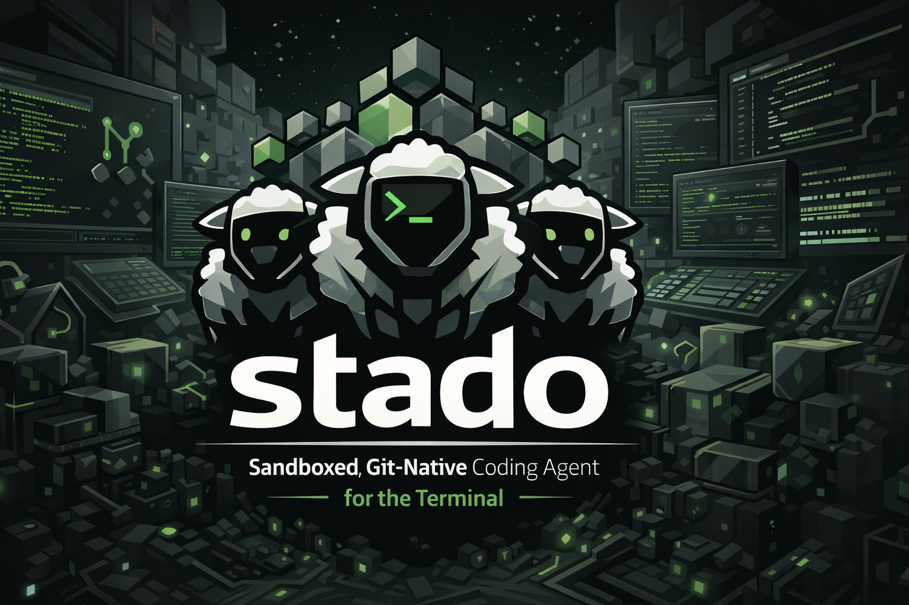

<p align="center">
  
</p>

<p align="center">
  <a href="https://github.com/foobarto/stado/actions/workflows/ci.yml"></a>
  <a href="https://github.com/foobarto/stado/releases/latest"></a>
  <a href="https://goreportcard.com/report/github.com/foobarto/stado"></a>
  <a href="https://pkg.go.dev/github.com/foobarto/stado"></a>
  
  <a href="LICENSE"></a>
  <a href="https://securityscorecards.dev/viewer/?uri=github.com/foobarto/stado"></a>
</p>

# stado

A sandboxed, git-native coding agent for the terminal.

Every tool call is committed to a signed audit log. Agent state lives in
a sidecar git repo — your working tree stays pristine until you
explicitly land changes. Tool execution is capability-gated through the
OS sandbox. Releases are reproducible and dual-signed (cosign + minisign)
so you can verify what you're running, including from an airgapped
environment.

> **Status:** pre-1.0. The core agent loop, git-native sessions, signed
> audit log, Linux/macOS sandboxing, MCP/ACP, signed WASM plugins, and
> context management are shipped. Main remaining gap: Windows sandbox
> v2. See
> [PLAN.md](PLAN.md) for the phased roadmap.

---

## Why stado

- **Your repo stays clean.** Agent state lives in a sidecar bare repo;
  changes only touch your branch when you run `stado session land`.
- **Every action is auditable.** Each session maintains signed `tree`
  and `trace` refs; `stado audit verify` detects tampering.
- **Tool execution is sandboxed.** Linux has the strongest shipped path
  (`Landlock` + `bubblewrap` + `seccomp`), macOS has real subprocess
  sandboxing via `sandbox-exec`, and Windows is still warning-only in
  v1. Built-in and third-party WASM tools run inside `wazero` and are
  gated by manifest capabilities rather than the OS subprocess runner.
- **Provider support is direct.** Anthropic, OpenAI, Google, and
  OpenAI-compatible backends keep provider-native features instead of
  flattening them behind a lossy abstraction.
- **Releases are verifiable.** Builds are reproducible and shipped with
  cosign + minisign signatures.

---

## Install

### Install script (Linux, macOS)

`install.sh` is the first-install path. It downloads the signed
`checksums.txt` manifest from the latest release (or a pinned tag),
verifies that manifest with `cosign`, verifies the matching archive
against the manifest, and installs `stado` to `~/.local/bin` by
default.

Requirements: `curl`, `cosign`, `tar`, and either `sha256sum` or
`shasum`.

```sh
curl -fsSL https://raw.githubusercontent.com/foobarto/stado/main/install.sh | bash
```

Useful overrides:

```sh
curl -fsSL https://raw.githubusercontent.com/foobarto/stado/main/install.sh | \
  bash -s -- --dir /usr/local/bin --version v0.9.0
```

### Homebrew

```sh
brew install foobarto/tap/stado
```

### Self-update (existing installs)

```sh
stado self-update --dry-run
stado self-update
```

`self-update` picks the archive matching the current OS/arch, verifies
the downloaded asset against a minisign-verified `checksums.txt`
manifest, and then atomically swaps the binary into place. The updater
requires a build with an embedded minisign pubkey and a release that
publishes `checksums.txt.minisig`; it does not fall back to unsigned
manifest or raw-asset verification.

### Manual download / release assets

Grab the matching archive or package from
[Releases](https://github.com/foobarto/stado/releases) and verify
`checksums.txt`, then verify the specific asset against that manifest:

```sh
# keyless cosign verification of the checksum manifest
cosign verify-blob \
  --certificate checksums.txt.cert \
  --certificate-identity-regexp 'https://github.com/foobarto/stado/.github/workflows/' \
  --certificate-oidc-issuer https://token.actions.githubusercontent.com \
  --signature checksums.txt.sig \
  checksums.txt

# replace <asset> with the archive/package you downloaded
grep " <asset>$" checksums.txt | sha256sum -c -         # Linux
grep " <asset>$" checksums.txt | shasum -a 256 -c -    # macOS

# inspect the minisign root embedded in the stado binary you already trust
stado verify --show-builtin-keys
```

For the fully manual airgapped minisign flow, see
[SECURITY.md](SECURITY.md).

### From source

```sh
go install github.com/foobarto/stado/cmd/stado@latest
```

Go 1.25+. Pure Go, `CGO_ENABLED=0` works. No native deps — official
release binaries bundle `rg` and `ast-grep` via `go:embed` (extracted
on first use to `$XDG_CACHE_HOME/stado/bin/`, sha256-verified). Source
builds (`go install`) skip the embed and fall back to the system PATH;
`gopls` is optional and always resolved via PATH. Dev/source builds do
not pin the release minisign roots unless you pass the release ldflags.

---

## Quick start

```sh
# Point stado at an LLM provider. Any of:
export ANTHROPIC_API_KEY=sk-ant-...
export OPENAI_API_KEY=sk-...
export GOOGLE_API_KEY=...
# Or a local model:
export STADO_DEFAULTS_PROVIDER=ollama     # http://localhost:11434/v1
export STADO_DEFAULTS_PROVIDER=lmstudio   # http://localhost:1234/v1
export STADO_DEFAULTS_PROVIDER=llamacpp   # http://localhost:8080/v1

# Scaffold config (optional — stado works with env vars alone)
stado config init

# Optional preflight: provider keys, sandbox, bundled binaries
stado doctor
stado doctor --json --no-local         # machine-readable CI/offline path

# Enter a repo and start a session
cd ~/code/myproject
stado
```

The TUI opens with an input box. Type a request; stado streams the
response, executes the configured tool surface, and commits every tool
call to the session's audit log. Plugins that declare `ui:approval` can
still request explicit Allow/Deny confirmation in the TUI.

### Useful first commands

Core session workflow:

```sh
stado session ls                        # sessions in this repo (ls alias for list)
stado session show <id>                 # refs + worktree + latest commit + usage totals
stado session describe <id> "label"     # attach a human label; surfaces in list + TUI sidebar
stado session resume react              # resume by id, id-prefix, or description substring
stado session logs <id>                 # tool-call audit as a scannable one-line feed
stado session export <id> -o out.md     # conversation as markdown (or --format jsonl)
stado session search "react hook"       # grep across every session's conversation
stado session gc --older-than=24h       # sweep zero-turn sessions (dry-run by default)
stado session fork <id> --at turns/5    # fork from an earlier turn
stado session tree <id>                 # interactive fork-from-turn picker
stado agents list                       # active/stale parallel worktrees for this repo
stado session land <id> <branch>        # push agent's tree to your repo
stado audit verify <id>                 # tamper-check the audit log
stado audit export <id> > audit.jsonl   # machine-readable tree/trace history
```

Run + stats + config:

```sh
stado run --prompt "..."                # one-shot, provider-only
stado run --tools --prompt "..."        # one-shot with the audited tool loop
stado run --session <id> "follow-up"    # continue an existing session from the CLI
stado stats                             # cost + token dashboard (past 7 days)
stado stats --json | jq                 # same, for scripting
stado config show                       # resolved effective config (file + env + defaults)
stado doctor                            # env diagnostic (runners, sandbox, binaries)
stado doctor --json | jq                # newline-delimited JSON, one check per line
```

Plugins:

```sh
stado plugin init my-plugin             # scaffold a Go wasip1 plugin
stado plugin gen-key my-plugin.seed     # one-time signer key
stado plugin sign plugin.manifest.json --key my-plugin.seed --wasm plugin.wasm
stado plugin trust <pubkey-hex> "Alice Example"
stado plugin verify .                   # signature + digest + rollback/CRL/Rekor
stado plugin install .                  # copy into state/plugins/
stado plugin list                       # pinned signer keys
stado plugin installed                  # installed plugin IDs
stado plugin run <id> <tool> '{...}'    # invoke a plugin tool directly
stado plugin run --session <sid> <id> <tool> '{...}'  # session-aware plugin CLI
```

`plugin list` shows trusted authors; `plugin installed` shows runnable
plugin IDs (`<name>-<version>`). The shipped bundled plugin catalog
lives under [plugins/](plugins/): `plugins/default/auto-compact/` is on
by default, while [plugins/examples/](plugins/examples/) are opt-in
authoring samples.

Aliases: `ls` → `list`, `rm` → `delete`, `cat` → `export`.

### Headless (scripted) use

```sh
# One-shot, exits after the agent finishes
stado run --prompt "add a CHANGELOG entry for v0.9.0" --json

# Long-running daemon; drive from any JSON-RPC 2.0 client
stado headless
```

### Editor integration (Zed, Neovim)

stado speaks Zed's Agent Client Protocol. Configure stado as your agent
backend and drive from the editor:

```sh
stado acp --tools
```

See [docs/README.md](docs/README.md) for the current guide index.
Editor-specific ACP setup docs are still sparse, but the command
surface itself is shipped and stable enough to wire into Zed today.

---

## Highlights

- **Providers.** Anthropic, OpenAI, Google, and OpenAI-compatible
  backends with provider-native reasoning/thinking features preserved.
- **Tools.** 14 bundled tools, MCP tool registration, and signed WASM
  plugin overrides all flow through the same runtime.
- **State.** Git-native sidecar sessions with signed `tree` + `trace`
  refs, plus resume/fork/land/export/search tooling.
- **Surfaces.** Terminal TUI, `stado run`, headless JSON-RPC, ACP, and
  MCP server mode all compose the same core runtime.
- **Ops.** Strict manifest-based self-update, OpenTelemetry, context
  management, and signed audit export are already shipped.
- **Recovery.** Bundled `auto-compact` is enabled by default as a
  background plugin; when the TUI hits the hard context threshold it
  forks a compacted child session and replays the blocked prompt there.

For the full as-built detail, see [docs/README.md](docs/README.md),
[DESIGN.md](DESIGN.md), and [PLAN.md](PLAN.md).

---

## What's in flight

See [PLAN.md](PLAN.md) for the full roadmap. Headlines:

- **Sandbox — Windows v2** (Phase 3.6). Linux (bubblewrap + landlock +
  seccomp + CONNECT-proxy) and macOS (`sandbox-exec`) are shipped;
  Windows runs unsandboxed with a warning until job objects + restricted
  tokens land in v2.
- **Release distribution** (Phase 10.3b / 10.7 tail). The Homebrew tap
  is already live and release archives/packages are built today; the
  remaining work is signed apt/rpm repository hosting plus the release
  ceremony that seeds embedded minisign roots into tagged builds.

---

## Offline / airgap

stado works fully offline with local inference backends such as
`llama.cpp`, Ollama, LM Studio, and vLLM.

Build with `-tags airgap` to strip the outbound HTTP paths that stado
itself controls: `self-update` refuses to run, `plugin install` stops
refreshing the CRL and uses the on-disk cache, and `webfetch` errors on
every invocation. Provider endpoints remain whatever you point stado at.

Release verification stays offline-friendly via `checksums.txt.minisig`
and `stado verify --show-builtin-keys`. For the detailed flow, see
[SECURITY.md](SECURITY.md). For the honest tradeoff discussion on local
model quality, see [PLAN.md](PLAN.md#offline--airgap-honesty).

---

## Configuration

stado reads `$XDG_CONFIG_HOME/stado/config.toml` (scaffolded by
`stado config init`):

```toml
[defaults]
provider = "anthropic"
model    = "claude-sonnet-4-6"

[agent]
thinking = "auto"
system_prompt_path = "~/.config/stado/system-prompt.md"

[inference.presets.my-proxy]
endpoint = "https://proxy.example/v1"

[mcp.servers.github]
command = "mcp-github"
args    = ["--readonly"]
env     = { GITHUB_TOKEN = "@env:GITHUB_TOKEN" }
capabilities = ["net:api.github.com", "env:GITHUB_TOKEN"]

[otel]
enabled  = false
endpoint = "localhost:4317"
protocol = "grpc"

[context]
soft_threshold = 0.70   # TUI shows a warning indicator above this
hard_threshold = 0.90   # TUI blocks new turns; headless emits a hard warning event
```

Every key is overridable via env var: `STADO_DEFAULTS_PROVIDER=ollama`,
`STADO_OTEL_ENABLED=1`, `STADO_CONTEXT_SOFT_THRESHOLD=0.6`, etc.
Underscores map to nested dots.

When `[otel].enabled = true`, the runtime-facing command surfaces
actually start the exporter runtime: `stado`, `stado session resume`,
`stado run`, `stado headless`, `stado acp`, and `stado mcp-server`.
`OTEL_EXPORTER_OTLP_ENDPOINT` is also honored as a fallback when
`[otel].endpoint` is unset.

Guide coverage is incremental. See [docs/README.md](docs/README.md) for
the current command/feature index; `stado config init`'s scaffolded file
and `stado config show` remain the quickest way to inspect keys that do
not yet have a dedicated guide.

---

## Paths

| Purpose | Path |
|---|---|
| Config | `$XDG_CONFIG_HOME/stado/config.toml` |
| Sidecar bare repo | `$XDG_DATA_HOME/stado/sessions/<repo-id>.git` |
| Agent signing key | `$XDG_DATA_HOME/stado/keys/agent.ed25519` |
| Session worktrees | `$XDG_STATE_HOME/stado/worktrees/<session-id>/` |
| Plugin trust store | `$XDG_DATA_HOME/stado/plugins/trusted_keys.json` |

Your repo's `.git` is never written to unless you run `stado session
land`. The sidecar repo is safe to delete — it rebuilds on next run.

---

## Configuring tools & sandboxing

Stado ships 14 bundled tools by default. `stado config show` prints the
resolved config and `stado doctor` reports the main runtime knobs.

### Trim the tool set

Two `[tools]` knobs in `config.toml`:

```toml
[tools]
# Allowlist — only these 3 tools are visible to the model. Every
# other bundled tool is silently omitted from the registry.
enabled  = ["read", "grep", "bash"]

# OR: start from the full default set and strip specific tools.
# enabled takes precedence when both are set.
disabled = ["webfetch", "bash"]
```

Unknown names warn on stderr and are ignored.

### Tool approvals

The old bundled-tool approval loop is gone. Use `[tools].enabled` /
`[tools].disabled` to control which native tools the model can see, and
use approval-wrapper plugins when a specific tool should ask a human
before delegating. Plugins with the `ui:approval` capability can open
the TUI approval card explicitly.

### Sandboxing

- **Linux** — `stado run --sandbox-fs` uses Landlock to narrow the
  whole process; sandboxed subprocesses use bubblewrap + seccomp BPF.
  The built-in `bash` tool defaults to deny-all networking on this path.
  For `net:<host>` policies on subprocesses and MCP stdio servers,
  stado wraps the subprocess in `pasta --splice-only` and exposes only
  its local CONNECT-allowlist proxy port inside the private netns.
- **macOS** — sandboxed subprocesses run under generated
  `sandbox-exec` profiles from the same policy vocabulary, but there is
  no Linux-style whole-process `--sandbox-fs` path.
- **Windows** — v1 remains warning-only passthrough; v2 is planned.
- **WASM plugins and bundled plugin-backed tools** — execute inside
  `wazero`; filesystem/session/LLM/tool access is mediated by
  capability-gated host imports rather than the OS subprocess runner.

`stado doctor` reports the sandbox runner in use. On Linux it also
reports Landlock availability.

### MCP server isolation

Each stdio `[mcp.servers.<name>]` block must declare a `capabilities`
list to gate what that local server can touch:

```toml
[mcp.servers.github]
command      = "mcp-github"
args         = ["--readonly"]
env          = { GITHUB_TOKEN = "@env:GITHUB_TOKEN" }
capabilities = [
  "net:api.github.com",
  "net:raw.githubusercontent.com",
  "env:GITHUB_TOKEN",
]
```

Capability grammar: `fs:read:<path>` · `fs:write:<path>` · `net:<host>`
· `net:allow` · `net:deny` · `exec:<binary>` · `env:<VAR>`. Stdio
servers without capabilities are refused at startup rather than run
unsandboxed. HTTP MCP servers (`url = "https://…"`) are not wrapped
locally; stdio servers (`command = …`) are. On Linux, `net:<host>`
entries require `pasta` (`passt` package) and run inside a private
netns where only the CONNECT proxy port is reachable. On macOS,
`net:<host>` remains `sandbox-exec`-enforced. Plain HTTP is still
outside the CONNECT proxy itself.

### WASM plugins

Third-party tools ship as signed wasm binaries, verified against an
Ed25519 trust store (`stado plugin trust <pubkey>`). Capabilities are
declared in the manifest, enforced by the `wazero` runtime — no
kernel-level sandbox needed because wasm already is one. See
[docs/commands/plugin.md](docs/commands/plugin.md) for the operator
workflow and [SECURITY.md](SECURITY.md) for the publish/signing model.

The default bundled plugin is `auto-compact`: it is loaded as a
background plugin automatically in the TUI and headless server. Extra
installed background plugins from `[plugins].background` are additive,
not a replacement for that default.

---

## Docs

- [docs/README.md](docs/README.md) — guide index; shows which commands
  and features have standalone docs vs where `stado --help` is still
  authoritative
- [docs/commands/session.md](docs/commands/session.md) — session
  lifecycle, fork/land flow, and export/search/logging
- [docs/commands/plugin.md](docs/commands/plugin.md) — scaffold → sign
  → trust → verify → install → run for WASM plugins
- [docs/features/instructions.md](docs/features/instructions.md) —
  `AGENTS.md` / `CLAUDE.md` resolution and loading rules
- [docs/eps/README.md](docs/eps/README.md) — enhancement proposals and
  retroactive design records for the major shipped decisions
- [DESIGN.md](DESIGN.md) — as-built architecture
- [PLAN.md](PLAN.md) — phased roadmap and remaining work
- [CONTRIBUTING.md](CONTRIBUTING.md) — build, test, contribute
- [SECURITY.md](SECURITY.md) — supply-chain model, key rotation, plugin
  publishing, and vulnerability reporting

---

## Design principles

Four commitments that shape every architectural decision:

1. **The user's repo is read-only until they say otherwise.** Agent
   state lives outside. Landing is always explicit.
2. **Every action is auditable and tamper-evident.** No unsigned
   commits, no un-logged tool calls, no "trust us" on the agent's
   behavior.
3. **Capabilities are declared, the OS enforces.** Not "the agent
   promises not to touch /etc/shadow" — the kernel prevents it.
4. **No lossy abstraction over provider capabilities.** Thinking
   blocks, reasoning content, prompt caching breakpoints round-trip
   verbatim. The agent loop branches on capabilities rather than
   papering over differences.

---

## License

Apache-2.0. See [LICENSE](LICENSE) for the full text.

---

## Acknowledgements

stado builds on [go-git](https://github.com/go-git/go-git),
[bubbletea](https://github.com/charmbracelet/bubbletea),
[koanf](https://github.com/knadh/koanf),
[tiktoken-go](https://github.com/pkoukk/tiktoken-go) (with the offline
BPE loader), and the official provider SDKs from Anthropic, OpenAI,
and Google. The WASM plugin runtime uses
[wazero](https://github.com/tetratelabs/wazero). The Agent Client
Protocol is developed by [Zed](https://github.com/zed-industries/agent-client-protocol).
The Model Context Protocol is developed by [Anthropic](https://modelcontextprotocol.io/).

<p align="center">
  
</p>
