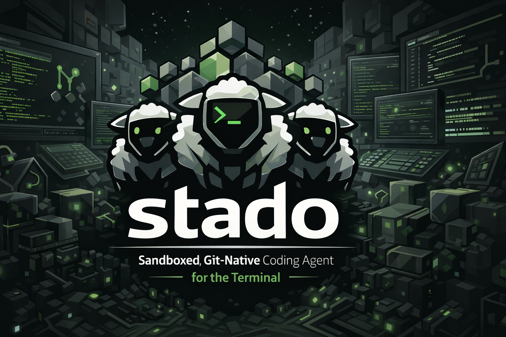
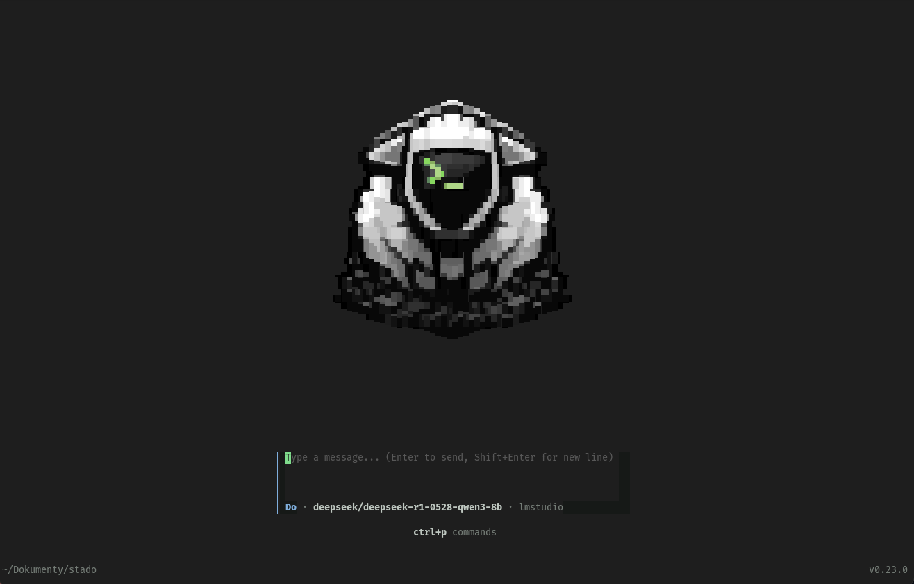
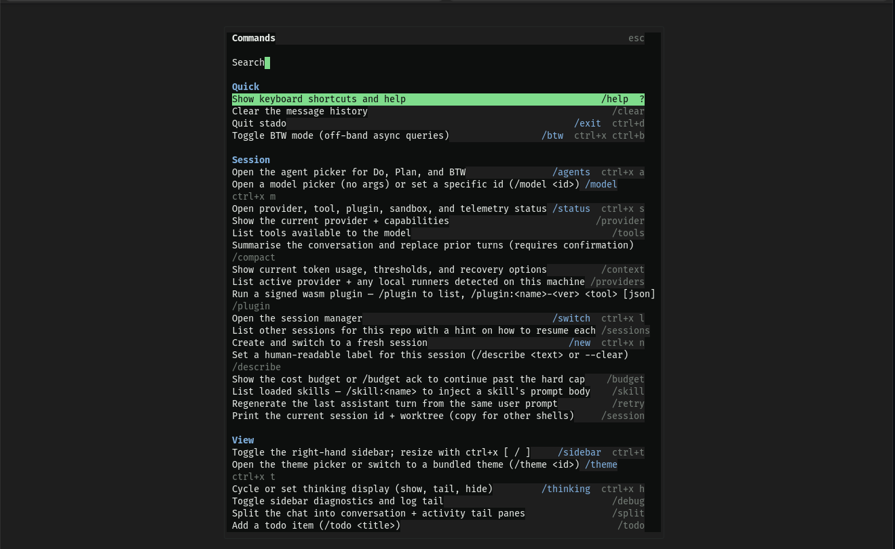
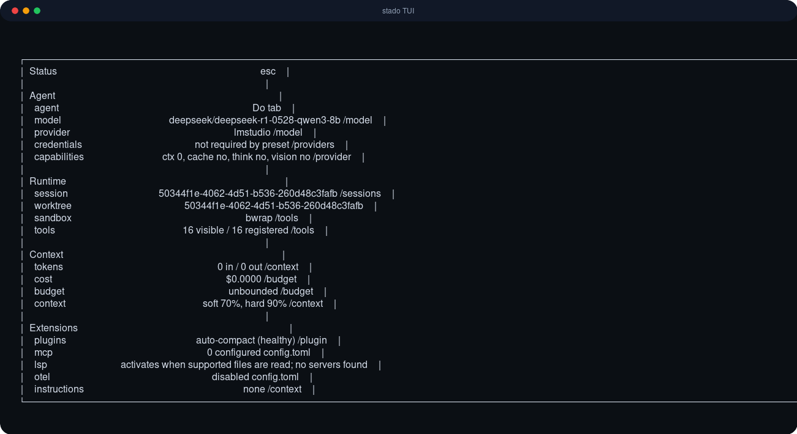
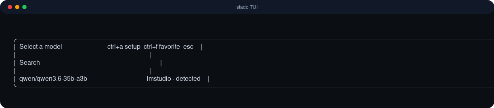
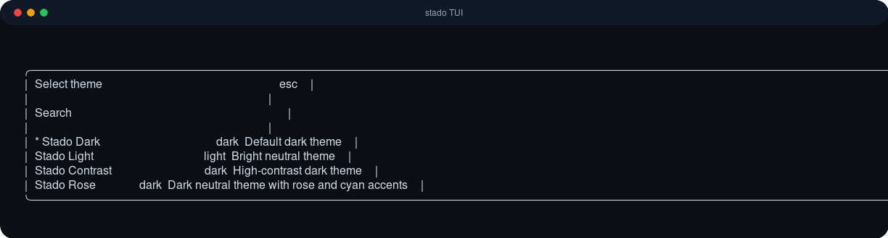

<p align="center">
  
</p>

<p align="center">
  <a href="https://github.com/foobarto/stado/actions/workflows/ci.yml"></a>
  <a href="https://github.com/foobarto/stado/actions/workflows/codeql.yml"></a>
  <a href="https://github.com/foobarto/stado/releases/latest"></a>
  <a href="https://goreportcard.com/report/github.com/foobarto/stado"></a>
  <a href="https://pkg.go.dev/github.com/foobarto/stado"></a>
  
  <a href="#license"></a>
  <a href="https://securityscorecards.dev/viewer/?uri=github.com/foobarto/stado"></a>
  <a href="https://www.bestpractices.dev/projects/12944"></a>
  <a href="SECURITY.md"></a>
</p>

# stado

A sandboxed, git-native coding agent for the terminal.

Every tool call is committed to a signed audit log. Agent state lives in
a sidecar git repo — your working tree stays pristine until you
explicitly land changes. Tool execution is capability-gated through the
OS sandbox. Releases are reproducible and dual-signed (cosign + minisign)
so you can verify what you're running, including from an airgapped
environment.

> **Status:** pre-1.0. The core agent loop, git-native sessions, signed
> audit log, Linux/macOS sandboxing, MCP/ACP, signed WASM plugins, and
> adaptive retrieval, trajectory learning, retained subagents, durable
> mailboxes, and resumable broker automation are shipped. Main remaining gap: Windows sandbox
> v2. See
> [PLAN.md](PLAN.md) for the phased roadmap.
>
> **Working in this codebase (agent or human)?** Jump to the
> [repository map for agents](#repository-map-for-agents) — a dense
> source-tree navigation guide.

---

## Why stado

- **Your repo stays clean.** Agent state lives in a sidecar bare repo;
  changes only touch your branch when you run `stado session land`.
- **Every action is auditable.** Each session maintains signed `tree`
  and `trace` refs; `stado audit verify` detects tampering.
- **Tool execution is sandboxed.** Linux has the strongest shipped path
  (`Landlock` + `bubblewrap` + `seccomp`), macOS has real subprocess
  sandboxing via `sandbox-exec`, and Windows is still warning-only in
  v1. Built-in and third-party WASM tools run inside `wazero` and are
  gated by manifest capabilities rather than the OS subprocess runner.
- **Provider support is direct.** Anthropic, OpenAI, Google, and
  OpenAI-compatible backends keep provider-native features instead of
  flattening them behind a lossy abstraction.
- **Releases are verifiable.** Builds are reproducible and shipped with
  cosign + minisign signatures.

## Feature highlights

The newer pieces turn stado from a safe coding loop into a durable agent
runtime. A few highlights from recently shipped capabilities and their EPs:

| Capability | What makes it useful |
| --- | --- |
| **Plugin-first tools + signed WASM runtime** ([EP-0002](docs/eps/0002-all-tools-as-plugins.md), [EP-0006](docs/eps/0006-signed-wasm-plugin-runtime.md), [EP-0038](docs/eps/0038-abi-v2-bundled-wasm-and-runtime.md)) | Keep integrations replaceable instead of baking them into the loop. Most bundled tools and installed third-party tools share a capability-gated ABI and `wazero` runtime; bundled modules are trusted embedded release assets, while installed plugins require signature, trust-store, and digest verification. The shared `tasks` tool remains a documented native bootstrap exception pending migration. |
| **Isolated research agents** ([EP-0054](docs/eps/0054-addressable-context-and-research-agents.md)) | Delegate repository archaeology and long investigations without flooding the main conversation; address the result later by durable handle. |
| **Retained subagents + mailboxes** ([EP-0055](docs/eps/0055-retained-resumable-subagents.md), [EP-0056](docs/eps/0056-agent-mailboxes-and-supervision.md)) | Keep useful workers alive across turns, supervise them, and exchange durable messages instead of losing coordination when one prompt ends. |
| **Measured adaptive-retrieval shadowing** ([EP-0058](docs/eps/0058-measured-adaptive-retrieval.md)) | Compare explainable candidate rankings against active bounded retrieval and report feedback signals without changing what the prompt receives yet. |
| **Trajectory learning** ([EP-0052](docs/eps/0052-learn-trajectory-refinement.md)) | Review completed sessions for concrete lesson candidates, approve the useful ones, and feed them back into future work. |
| **Session journal + deterministic signals** ([EP-0057](docs/eps/0057-session-state-journal-decisions-and-signals.md)) | Project objectives, blockers, decisions, corrections, and mistakes into queryable durable state rather than reconstructing them from chat. |
| **Durable broker, events, and budgets** ([EP-0059](docs/eps/0059-durable-event-and-budget-substrate.md)) | Give agents and automations resumable event delivery, explicit budgets, crash-safe coordination, and one shared substrate for supervision. |
| **Verify Work command gates** ([EP-0046](docs/eps/0046-verify-work-phase.md)) | Run configured verification commands before completion and record their evidence; the EP's independent LLM judge remains deferred. |
| **Programmable Lua lifecycle hooks** ([EP-0051](docs/eps/0051-lua-lifecycle-hook-contract.md)) | Inspect, deny, or mutate lifecycle events through a constrained scripting contract while stado retains the actual enforcement boundary. |

Together with native bounded-harness guidance ([EP-0060](docs/eps/0060-native-harness-guidance.md)),
these capabilities teach the model when to research, delegate, learn, resume,
and coordinate while stado continues to own tools, policy, audit, and sandboxing.

---

## Install

### Install script (Linux, macOS)

`install.sh` is the first-install path. It downloads the signed
`checksums.txt` manifest from the latest release (or a pinned tag),
verifies that manifest with `cosign`, verifies the matching archive
against the manifest, and installs `stado` to `~/.local/bin` by
default.

Requirements: `curl`, `cosign`, `tar`, and either `sha256sum` or
`shasum`.

```sh
curl -fsSL https://raw.githubusercontent.com/foobarto/stado/main/install.sh | bash
```

Useful overrides:

```sh
curl -fsSL https://raw.githubusercontent.com/foobarto/stado/main/install.sh | \
  bash -s -- --dir /usr/local/bin --version v0.79.0
```

### Homebrew

```sh
brew install foobarto/tap/stado
```

### Self-update (existing installs)

```sh
stado self-update --dry-run
stado self-update
```

`self-update` picks the archive matching the current OS/arch, verifies
the downloaded asset against a minisign-verified `checksums.txt`
manifest, and then atomically swaps the binary into place. The updater
requires a build with an embedded minisign pubkey and a release that
publishes `checksums.txt.minisig`; it does not fall back to unsigned
manifest or raw-asset verification.

### Manual download / release assets

Grab the matching archive or package from
[Releases](https://github.com/foobarto/stado/releases) and verify
`checksums.txt`, then verify the specific asset against that manifest:

```sh
# keyless cosign verification of the checksum manifest
cosign verify-blob \
  --certificate checksums.txt.cert \
  --certificate-identity-regexp 'https://github.com/foobarto/stado/.github/workflows/' \
  --certificate-oidc-issuer https://token.actions.githubusercontent.com \
  --signature checksums.txt.sig \
  checksums.txt

# replace <asset> with the archive/package you downloaded
grep " <asset>$" checksums.txt | sha256sum -c -         # Linux
grep " <asset>$" checksums.txt | shasum -a 256 -c -    # macOS

# inspect the minisign root embedded in the stado binary you already trust
stado verify --show-builtin-keys
```

For the fully manual airgapped minisign flow, see
[SECURITY.md](SECURITY.md).

### From source

```sh
git clone https://github.com/foobarto/stado && cd stado && make
```

Build via `make`, not bare `go build`/`go install`: the bundled wasm tools are
compiled from source (`make wasm`) and `//go:embed`'d into the binary, so a
checkout is required — `go install …@latest` is **not** supported (the embed
has no committed wasm to find; EP-0042). Go 1.26+ (per `go.mod`), pure Go (`CGO_ENABLED=0`).
Native `rg`/`ast-grep` are fetched + embedded only in official release builds
(extracted on first use to `$XDG_CACHE_HOME/stado/bin/`, sha256-verified);
source/`make` builds fall back to the system PATH. `gopls` is optional, always
via PATH. Dev/source builds do not pin the release minisign roots unless you
pass the release ldflags. `make help` lists the dev-loop targets
(`test`, `lint`, `check`, etc.).

---

## Quick start

```sh
# Point stado at an LLM provider. Any of:
export ANTHROPIC_API_KEY=sk-ant-...
export OPENAI_API_KEY=sk-...
export GOOGLE_API_KEY=...
# Or a local model:
export STADO_DEFAULTS_PROVIDER=ollama     # http://localhost:11434/v1
export STADO_DEFAULTS_PROVIDER=lmstudio   # http://localhost:1234/v1
export STADO_DEFAULTS_PROVIDER=llamacpp   # http://localhost:8080/v1

# Scaffold config (optional — stado works with env vars alone)
stado config init

# Optional preflight: provider keys, sandbox, bundled binaries
stado doctor
stado doctor --json --no-local         # machine-readable CI/offline path

# Enter a repo and start a session
cd ~/code/myproject
stado
```

The TUI opens with an input box. Type a request; stado streams the
response, executes the configured tool surface, and commits every tool
call to the session's audit log. Plugins that declare `ui:approval` can
still request explicit Allow/Deny confirmation in the TUI.
Use `Ctrl+X H` or `/thinking show|tail|hide` to control how much
provider-native thinking is rendered without changing what stado
captures in the transcript.
Press `/` on an empty prompt for inline slash-command suggestions, or
`Ctrl+P` for the full command palette. Use `Ctrl+X M` or `/model` to
switch models; selections become the next startup default. Use
`Ctrl+X K` or `/tasks` to open the shared task manager that both you
and the agent can update.

### TUI screenshots

| Landing view | Command palette |
| --- | --- |
|  |  |

| Status modal | Model picker | Theme picker |
| --- | --- | --- |
|  |  |  |

### Useful first commands

Core session workflow:

```sh
stado session ls                        # sessions in this repo (ls alias for list)
stado session show <id>                 # refs + worktree + latest commit + usage totals
stado session describe <id> "label"     # attach a human label; surfaces in list + TUI sidebar
stado session resume react              # resume by id, id-prefix, or description substring
stado session logs <id>                 # tool-call audit as a scannable one-line feed
stado session export <id> -o out.md     # conversation as markdown (or --format jsonl)
stado session search "react hook"       # grep across every session's conversation
stado session gc --older-than=24h       # sweep zero-turn sessions (dry-run by default)
stado session fork <id> --at turns/5    # fork from an earlier turn
stado session tree <id>                 # interactive fork-from-turn picker
stado session kill <id>                 # stop a running session's process + drop its worktree (keeps history)
stado session land <id> <branch>        # push agent's tree to your repo
stado audit verify <id>                 # tamper-check the audit log
stado audit export <id> > audit.jsonl   # machine-readable tree/trace history
```

Run + stats + config:

```sh
stado run --prompt "..."                # one-shot, provider-only
stado run --tools --prompt "..."        # one-shot with the audited tool loop
stado run --session <id> "follow-up"    # continue an existing session from the CLI
stado stats                             # cost + token dashboard (past 7 days)
stado stats --json | jq                 # same, for scripting
stado config show                       # resolved effective config (file + env + defaults)
stado memory list                       # review plugin-proposed/approved memories
stado learn --session-id <id>           # review a completed trajectory for lesson candidates
stado learn candidates --session-id <id> # inspect candidates from that session review
stado session state <id>                # bounded objective/work/blocker projection
stado session signals <id>              # deterministic mistake/correction signals
stado session journal <id>              # canonical structured session chronology
stado run --tools --prompt "create tasks for the release checklist"
stado doctor                            # env diagnostic (runners, sandbox, binaries)
stado doctor --json | jq                # newline-delimited JSON, one check per line
```

Plugins:

```sh
stado plugin init my-plugin             # scaffold a Go wasip1 plugin
stado plugin gen-key my-plugin.seed     # one-time signer key
stado plugin sign plugin.manifest.json --key my-plugin.seed --wasm plugin.wasm
stado plugin trust <pubkey-hex> "Alice Example"
stado plugin verify .                   # signature + digest + rollback/CRL/Rekor
stado plugin install .                  # install globally under user state
stado plugin install --local .          # install under this project's .stado/plugins/
stado plugin list                       # detailed bundled + installed catalog
stado plugin installed                  # concise IDs with project/global scope
stado tool run <tool> '{...}'           # invoke a plugin tool directly
stado tool run --session <sid> <tool> '{...}'  # session-aware tool CLI
```

`plugin list` shows the detailed catalog and trust state; `plugin installed`
shows runnable plugin IDs (`<name>-<version>`) and project/global scope. The
shipped bundled plugin catalog lives under [plugins/bundled/](plugins/bundled/):
`plugins/bundled/auto-compact/`
is on by default. Opt-in plugins (the former `optional/` + `demos/`) now live in
[foobarto/stado-plugins](https://github.com/foobarto/stado-plugins) and install
via `stado plugin install github.com/foobarto/stado-plugins/<plugin>@<version>`.

Aliases: `ls` → `list`, `rm` → `delete`, `cat` → `export`.

### Headless (scripted) use

```sh
# One-shot, exits after the agent finishes
stado run --prompt "add a CHANGELOG entry for the next release" --json

# Long-running daemon; drive from any JSON-RPC 2.0 client
stado run --headless
```

### Editor integration (Zed, Neovim)

stado speaks Zed's Agent Client Protocol. Configure stado as your agent
backend and drive from the editor:

```sh
stado acp --tools
```

See [docs/README.md](docs/README.md) for the current guide index.
Editor-specific ACP setup docs are still sparse, but the command
surface itself is shipped and stable enough to wire into Zed today.

### Learning, memory, and context research

Stado treats useful context as governed state rather than an ever-growing
prompt. The fast path injects only active, authorized, non-expired memories and
lessons under hard item and token limits. The slower `memory__research` and
`session__research` tools delegate a query to an isolated research agent, which
can search and open a bounded authorized corpus without filling the parent
agent's context. The parent receives a synthesis with digest-bound citations and
short supporting excerpts instead of the raw material explored by the child.

Learning is explicit and evidence-backed:

```sh
stado learn --session-id <id>                 # same as: stado learn run ...
stado learn candidates --session-id <id>
stado learn artifact <artifact-id> --session-id <id>
stado learn retrieval-report                  # shadow-ranking observations
stado learn migrate                           # idempotent legacy-memory import
```

Inside the TUI, `/learn [focus]` reviews the just-completed trajectory. The
reviewer considers deterministic signals such as repeated tool failures,
argument corrections followed by success, verification fail→pass transitions,
scope denials, and explicit operator corrections. It proposes versioned lesson
candidates but cannot activate them. Use `/learn candidates`, `/learn show
<id>`, and `/learn approve <id>` for the trusted interactive review path;
ordinary CLI or agent-shell execution cannot mint an operator approval.

Artifacts retain host-bound global, repository, or session scope plus
provenance, sensitivity, tags, groups, evidence, and version history. Session
scope flows from the creating session to descendants, never to siblings or
ancestors. Active memories remain untrusted guidance below operator and repo
instructions and cannot grant tools or capabilities. See
[Adaptive context and learning](docs/adaptive-context.md) and the
[`stado learn` guide](docs/commands/learning.md) for the full contract.

Stado also supplies bounded native harness guidance at model-turn boundaries.
Strong unreviewed mechanical signals prompt the agent to preserve a candidate
lesson and ask you to use `/learn`; historical questions can be routed to the
isolated memory/session researchers, and retained children with pending work
trigger mailbox coordination reminders. These nudges use fixed host templates,
never embed mailbox/tool payloads, and cannot approve memory or widen authority.

Retained subagents complement this memory system for longer work. They can fork
an authorized historical session into a new identity with an attenuated tool,
permission, model, and budget profile; durable handles support messaging,
cancellation, and bounded supervision across parent restarts. Historical
context contributes data, never authority.

---

## Capability map

- **Providers.** Anthropic, OpenAI, Google, and OpenAI-compatible
  backends with provider-native reasoning/thinking features preserved.
- **Tools.** Bundled tools, MCP tool registration, and signed WASM
  plugin overrides all flow through the same runtime.
- **State.** Git-native sidecar sessions with signed `tree` + `trace`
  refs, shared user/agent tasks, plus resume/fork/land/export/search
  tooling.
- **Surfaces.** Terminal TUI, `stado run`, headless JSON-RPC, ACP, and
  MCP server mode all compose the same core runtime.
- **Ops.** Strict manifest-based self-update, OpenTelemetry, context
  management, and signed audit export are already shipped.
- **Learning.** Evidence-backed `stado learn`/`/learn`, scoped versioned
  memories, isolated memory/session research, bounded state and signals, and
  shadow adaptive retrieval are shipped.
- **Recovery.** Bundled `auto-compact` is enabled by default as a
  background plugin; when the TUI hits the hard context threshold it
  forks a compacted child session and replays the blocked prompt there.

### Recent changes

stado releases often. The
[latest release](https://github.com/foobarto/stado/releases/latest) and
[CHANGELOG.md](CHANGELOG.md) are the authoritative record of what shipped
(the current release is also summarised on the TUI landing screen). For the
design rationale behind a change, the [EPs](docs/eps/) are the durable
record.

For the full as-built detail, see [docs/README.md](docs/README.md),
[DESIGN.md](DESIGN.md), and [PLAN.md](PLAN.md).

---

## What's in flight

See [PLAN.md](PLAN.md) for the full roadmap. Headlines:

- **Sandbox — Windows v2** (Phase 3.6). Linux (bubblewrap + landlock +
  seccomp + CONNECT-proxy) and macOS (`sandbox-exec`) are shipped;
  Windows runs unsandboxed with a warning until job objects + restricted
  tokens land in v2.
- **Release distribution** (Phase 10.3b / 10.7 tail). The Homebrew tap
  is already live and release archives/packages are built today; the
  remaining work is signed apt/rpm repository hosting plus the release
  ceremony that seeds embedded minisign roots into tagged builds.

---

## Offline / airgap

stado works fully offline with local inference backends such as
`llama.cpp`, Ollama, LM Studio, and vLLM.

Build with `-tags airgap` to strip the outbound HTTP paths that stado
itself controls: `self-update` refuses to run, `plugin install` stops
refreshing the CRL and uses the on-disk cache, and `webfetch` errors on
every invocation. Provider endpoints remain whatever you point stado at.

Release verification stays offline-friendly via `checksums.txt.minisig`
and `stado verify --show-builtin-keys`. For the detailed flow, see
[SECURITY.md](SECURITY.md). For the honest tradeoff discussion on local
model quality, see [PLAN.md](PLAN.md#offline--airgap-honesty).

---

## Configuration

stado reads `$XDG_CONFIG_HOME/stado/config.toml` (scaffolded by
`stado config init`):

```toml
[defaults]
provider = "anthropic"
model    = "claude-sonnet-4-6"

[agent]
thinking = "auto"
system_prompt_path = "~/.config/stado/system-prompt.md"

[memory]
enabled = false       # opt in to approved-memory prompt context
max_items = 8
budget_tokens = 800

[inference.presets.my-proxy]
endpoint = "https://proxy.example/v1"

[mcp.servers.github]
command = "mcp-github"
args    = ["--readonly"]
env     = { GITHUB_TOKEN = "@env:GITHUB_TOKEN" }
capabilities = ["net:api.github.com", "env:GITHUB_TOKEN"]

[otel]
enabled  = false
endpoint = "localhost:4317"
protocol = "grpc"

[context]
soft_threshold = 0.70   # TUI shows a warning indicator above this
hard_threshold = 0.90   # TUI blocks new turns; headless emits a hard warning event
```

Every key is overridable via env var: `STADO_DEFAULTS_PROVIDER=ollama`,
`STADO_OTEL_ENABLED=1`, `STADO_CONTEXT_SOFT_THRESHOLD=0.6`, etc.
Underscores map to nested dots. Root flags `--provider` and `--model`
override `[defaults]` after load.

Repos may ship `.stado/config.toml` as a **partial overlay** — security-
sensitive keys (`[hooks]`, `[keymap]`, `[mcp.servers]`, …) are stripped;
project personas and `.stado/plugins/` require explicit user-config opt-in.
See [docs/commands/config.md](docs/commands/config.md#project-overlay-stadoconfigtoml).

When `[otel].enabled = true`, the runtime-facing command surfaces
actually start the exporter runtime: `stado`, `stado session resume`,
`stado run`, `stado run --headless`, `stado acp`, and `stado mcp-server`.
`OTEL_EXPORTER_OTLP_ENDPOINT` is also honored as a fallback when
`[otel].endpoint` is unset.

Guide coverage is incremental. See [docs/README.md](docs/README.md) for
the current command/feature index; `stado config init`'s scaffolded file
and `stado config show` remain the quickest way to inspect keys that do
not yet have a dedicated guide.

---

## Paths

| Purpose | Path |
|---|---|
| Config | `$XDG_CONFIG_HOME/stado/config.toml` |
| Sidecar bare repo | `$XDG_DATA_HOME/stado/sessions/<repo-id>.git` |
| Agent signing key | `$XDG_DATA_HOME/stado/keys/agent.ed25519` |
| Session worktrees | `$XDG_STATE_HOME/stado/worktrees/<session-id>/` |
| Plugin trust store | `$XDG_DATA_HOME/stado/plugins/trusted_keys.json` |

Your repo's `.git` is never written to unless you run `stado session
land`. The sidecar repo is safe to delete — it rebuilds on next run.

---

## Configuring tools & sandboxing

Stado ships a broad bundled tool surface — filesystem, shell/PTY, web/DNS,
ripgrep/ast-grep, LSP, session-search, and agent-spawn families (dozens of
tools), all WASM-backed plugins. A small convenience core is auto-loaded
each turn; the rest are reachable on demand through the dispatch meta-tools.
`stado config show` prints the resolved config and `stado doctor` reports
the main runtime knobs.

### Trim the tool set

Two `[tools]` knobs in `config.toml`:

```toml
[tools]
# Allowlist — only these 3 tools are visible to the model. Every
# other bundled tool is silently omitted from the registry.
enabled  = ["read", "grep", "bash"]

# OR: start from the full default set and strip specific tools.
# enabled takes precedence when both are set.
disabled = ["webfetch", "bash"]
```

Unknown names warn on stderr and are ignored.

`webfetch` only supports `http` and `https`, refuses cross-host redirects, and
blocks loopback, private, link-local, and reserved IP targets when opening the
connection. Use `[tools].disabled = ["webfetch"]` for stricter offline or
no-network profiles.

### Tool approvals

The old bundled-tool approval loop is gone. Use `[tools].enabled` /
`[tools].disabled` to control which native tools the model can see, and
use approval-wrapper plugins when a specific tool should ask a human
before delegating. Plugins with the `ui:approval` capability can open
the TUI approval card explicitly.

### Sandboxing

As of v0.57.0 stado is **sandboxed by default** across every
interactive surface (TUI, `stado run`, `stado run --headless`, `stado acp`,
`stado mcp-server`). A privileged broker process (an evolution of
`stado daemon`) projects a per-session capability ceiling and mounts
the agent's namespace; the orchestrator can only request what global
policy permits. Opt out with `stado run --no-sandbox` (or
`STADO_BROKER_ATTACH=0` for development scenarios — see migration
notes in `CHANGELOG.md` for v0.57.0).

- **Linux** — Bubblewrap mounts the agent's namespace; Landlock
  narrows the parent process to launch-cwd + `/tmp` writes. The
  built-in `bash` tool defaults to deny-all networking on this path.
  For `net:<host>` policies on subprocesses and MCP stdio servers,
  stado wraps the subprocess in `pasta --splice-only` and exposes only
  its local CONNECT-allowlist proxy port inside the private netns.
- **macOS** — sandboxed subprocesses run under generated
  `sandbox-exec` profiles from the same policy vocabulary; the broker
  + ceiling apply at the runner layer the same way as on Linux,
  minus the Landlock in-process belt-and-braces.
- **Windows** — v1 remains warning-only passthrough; v2 is planned.
- **WASM plugins and bundled plugin-backed tools** — execute inside
  `wazero`; filesystem/session/LLM/tool access is mediated by
  capability-gated host imports rather than the OS subprocess runner.

`stado doctor` reports the sandbox runner in use. On Linux it also
reports Landlock availability.

### MCP server isolation

Each stdio `[mcp.servers.<name>]` block must declare a `capabilities`
list to gate what that local server can touch:

```toml
[mcp.servers.github]
command      = "mcp-github"
args         = ["--readonly"]
env          = { GITHUB_TOKEN = "@env:GITHUB_TOKEN" }
capabilities = [
  "net:api.github.com",
  "net:raw.githubusercontent.com",
  "env:GITHUB_TOKEN",
]
```

Capability grammar: `fs:read:<path>` · `fs:write:<path>` · `net:<host>`
· `net:allow` · `net:deny` · `exec:<binary>` · `env:<VAR>`. Stdio
servers without capabilities are refused at startup rather than run
unsandboxed. HTTP MCP servers (`url = "https://…"`) are not wrapped
locally; stdio servers (`command = …`) are. On Linux, `net:<host>`
entries require `pasta` (`passt` package) and run inside a private
netns where only the CONNECT proxy port is reachable. On macOS,
`net:<host>` remains `sandbox-exec`-enforced. Plain HTTP is still
outside the CONNECT proxy itself.

### WASM plugins

Third-party tools ship as signed wasm binaries, verified against an
Ed25519 trust store (`stado plugin trust <pubkey>`). Capabilities are
declared in the manifest, enforced by the `wazero` runtime — no
kernel-level sandbox needed because wasm already is one. See
[docs/features/plugin-authoring.md](docs/features/plugin-authoring.md)
for the first-time-author walkthrough,
[docs/commands/plugin.md](docs/commands/plugin.md) for the per-command
reference, and [SECURITY.md](SECURITY.md) for the publish/signing model.

The default bundled plugin is `auto-compact`: it is loaded as a
background plugin automatically in the TUI and headless server. Extra
installed background plugins from `[plugins].background` are additive,
not a replacement for that default.

---

## Docs

- [docs/README.md](docs/README.md) — guide index; shows which commands
  and features have standalone docs vs where `stado --help` is still
  authoritative
- [docs/commands/session.md](docs/commands/session.md) — session
  lifecycle, fork/land flow, and export/search/logging
- [docs/commands/plugin.md](docs/commands/plugin.md) — scaffold → sign
  → trust → verify → install → run for WASM plugins (per-command
  reference)
- [docs/features/plugin-authoring.md](docs/features/plugin-authoring.md) —
  end-to-end first-time-author walkthrough (lifecycle, capability
  table, common patterns, common errors)
- [docs/features/instructions.md](docs/features/instructions.md) —
  `AGENTS.md` / `CLAUDE.md` resolution and loading rules
- [docs/eps/README.md](docs/eps/README.md) — enhancement proposals and
  retroactive design records for the major shipped decisions
- [DESIGN.md](DESIGN.md) — as-built architecture
- [PLAN.md](PLAN.md) — phased roadmap and remaining work
- [CONTRIBUTING.md](CONTRIBUTING.md) — build, test, contribute
- [SECURITY.md](SECURITY.md) — supply-chain model, key rotation, plugin
  publishing, and vulnerability reporting

---

## Repository map (for agents)

A dense orientation for an agent (or contributor) about to work in this
codebase. These are **source-tree** pointers; the human-facing guides are
under [Docs](#docs) above, and design rationale lives in the EPs (linked
below).

**Shape.** A single Go binary (`cmd/stado`, a cobra command tree) over
~45 `internal/` packages. Bubble Tea v2 TUI; tools run as capability-gated
WASM inside `wazero`. One UI-independent core (`internal/runtime`) backs
every surface (TUI, `run`, `headless`, `acp`, `mcp-server`). Build with
`make` — **not** `go install`: bundled wasm is compiled from source and
`//go:embed`'d (Go 1.26+, pure-Go `CGO_ENABLED=0`).

**Start here**

- `cmd/stado/main.go` — CLI root; bare `stado` boots the TUI.
- `internal/runtime/agentloop.go:AgentLoop` — the agent turn loop (turn →
  tool calls → exec → next turn).
- `internal/tools/executor.go:Run` — how one tool call is dispatched,
  sandboxed, and committed to the audit log.
- `pkg/tool/tool.go`, `pkg/agent/agent.go` — the public tool + provider
  SDK seams (the contracts everything else implements).

### Core engine, state, and security

| Path | Look here for |
|---|---|
| `internal/runtime/agentloop.go` | the agent turn loop; lifecycle hooks (pre/post-llm, post-turn); per-turn system-prompt assembly (`buildTurnSystem`) |
| `internal/runtime/executor.go` | building the default tool registry; `ApplyToolFilter` (enabled/disabled glob allowlist); autoload selection |
| `internal/tools/{executor,registry,classify}.go` | tool dispatch + per-call commit invariants; the name→tool registry; mutation class (tree vs trace commit) |
| `internal/providers/` (+ `pkg/agent`) | provider impls (anthropic/openai/google/oaicompat); native thinking-signature + prompt-cache round-trip |
| `internal/{instructions,personas,skills}` | AGENTS.md/CLAUDE.md loading; persona inheritance; `.stado/skills/*.md` → `/skill:` commands |
| `internal/{memory,artifacts,artifactprompt,learn,research}` | legacy and versioned memory; bounded prompt retrieval; evidence-backed learning; isolated memory/session researchers |
| `internal/{sessioncontext,stateprompt,trajectory}` | bounded operational state, journal, deterministic learning signals, and turn/tool observations |
| `internal/{tasks,orchestration}` | shared user+agent task list; retained child admission, leases, mailbox coordination, and supervision |
| `internal/{compact,streambudget,toolinput}` | user-invoked compaction; streamed-text + tool-arg size caps |
| `internal/runtime/subagent.go` (+ `internal/subagent`) | `spawn_agent`: child loop, forked worktree, write-scope projection |
| `internal/state/git/{sidecar,session}.go` | the sidecar-bare-repo state model; repo-id canonicalization; per-session `tree`/`trace` refs |
| `internal/state/git/{commit_write,commit_meta}.go` | where a session commit is written + signed; per-tool-call trailer format |
| `internal/audit/{signer,verify}.go` | the `stado-audit-v2` signature format; strict v2 verify (no v1 fallback); the audit ref-walk |
| `internal/sandbox/policy.go` | the capability grammar (`fs:`/`net:`/`exec:`/`env:`); policy intersection (`Merge`) |
| `internal/sandbox/{runner_linux,runner_darwin,landlock_linux,seccomp_linux,proxy}.go` | per-OS enforcement (bwrap/landlock/seccomp, sandbox-exec); the net-allowlist CONNECT proxy |
| `internal/broker/` | the privileged broker: session-ceiling projection, profiles, taint, mount table, canonical WAL/snapshots, artifact grants, mailboxes, retained lifecycle, and recursive budgets |
| `internal/{netguard,providers/envscrub,secrets}` | SSRF / private-IP egress blocking; subprocess env safelist (`inherit_env`); operator secret store |

### TUI (`internal/tui`)

| Path | Look here for |
|---|---|
| `model.go` · `model_update.go:Update` | the Bubble Tea v2 root model (central state); top-level message router |
| `app.go:Run` | TUI boot — provider / theme / keymap / registry wiring |
| `handler_input.go:onKey` | keypress routing; wiring a binding action to behavior (incl. `ctrl+x` chords) |
| `handler_{stream,tools,lifecycle}.go` | streamed-token draining + throttle; tool-call→block + output sanitization; turn start/finish |
| `model_commands.go:handleSlash` | what a `/command` *does* |
| `keys/{defaults,schema,config}.go` | the emacs base keymap; named schemas (emacs/vscode) as deltas; `[keymap.bindings]` overrides |
| `palette/{slash,registry}.go` | slash-command palette listing; dynamic (skill/plugin) commands |
| `render/render.go:WrapDescList` · `palette/slash.go:truncate` | the no-truncation list formatter; display-width (`ansi.Truncate`) helpers |
| `status_bar.go` · `sidebar.go` · `blocks_render.go` | status bar; right sidebar (incl. LSP diagnostics); per-frame conversation render |
| `*picker/picker.go` (model/theme/tree/fleet/agent/persona/provider/session/file) | each modal picker UI; trigger in `handler_input.go`, result in `handler_picker_response.go` |
| `theme/{theme,catalog}.go` | theme palette type; built-in theme presets |

### Surfaces, protocols, plugins

| Path | Look here for |
|---|---|
| `cmd/stado/{run,acp,mcp_server}.go` | the non-TUI surface entry points (all compose `internal/runtime`) |
| `internal/headless/server.go` · `internal/acp/server.go` | JSON-RPC headless daemon; stado-as-ACP-agent (Zed); shared line-delimited transport (`acp/jsonrpc.go`) |
| `internal/{mcp,mcpbridge}` · `runtime/mcp_glue.go` | MCP client (connect + capability-gate stdio servers); adapting a remote MCP tool; `stado mcp-server` is the inverse |
| `internal/{lsp,lspfind}` · `tui/sidebar.go:diagnosticEntryText` | LSP transport; per-session server lifecycle; diagnostics render + control-byte strip |
| `internal/telemetry` (+ `cmd/stado/telemetry_runtime.go`) | OpenTelemetry spans (session→turn→tool_call); off by default |
| `internal/plugins/runtime/{runtime,host,host_imports,tool}.go` | wazero load/instantiate; per-plugin capability gate; the `stado_*` host imports; the wasm tool-call ABI |
| `internal/plugins/{manifest,trust}.go` | manifest schema + Ed25519 signing; TOFU trust store, rollback + revocation |
| `internal/plugins/bundled` · `plugins/bundled/build.sh` | embedded bundled wasm (EP-0042); `auto-compact` (the default-on background plugin); `make wasm` |
| `internal/fs` · `internal/fs/hashline` | native read/write/edit/glob/grep tools; the `LINE#HASH` anchored-edit protocol |
| `internal/{rg,astgrep}` · `hack/fetch-binaries.go` · `hack/binary-pins.json` | embedded native `rg`/`ast-grep` extraction; build-time fetch + committed sha256 pins |

### Where do I change…?

| Task | Start at |
|---|---|
| add a CLI command / subcommand | `cmd/stado/<cmd>.go` (`rootCmd.AddCommand` in `init()`); subcommands under the group's file |
| author a tool / read the tool contract | `pkg/tool/tool.go`; register in `internal/runtime/executor.go:BuildDefaultRegistry`, class in `internal/tools/classify.go` |
| add / change a provider | implement `pkg/agent.Provider` in `internal/providers/<name>`; wire in `internal/tui/app.go` + `internal/config` |
| modify the agent turn loop | `internal/runtime/agentloop.go:AgentLoop` |
| filter / allowlist tools | `internal/runtime/executor.go:ApplyToolFilter` (`[tools].enabled/disabled`) |
| change a default keybinding / add a keymap schema | `internal/tui/keys/defaults.go` / `keys/schema.go` (deltas over emacs); action consts in `keys/actions.go` |
| register a slash command vs change its behavior | `internal/tui/palette/slash.go` vs `internal/tui/model_commands.go:handleSlash` |
| add / modify a picker | `internal/tui/<name>picker/picker.go` + trigger in `handler_input.go` + `handler_picker_response.go` |
| fix display-width truncation / wrapping | `internal/tui/render/render.go:WrapDescList` / `palette/slash.go:truncate` (`ansi.Truncate`) |
| add a built-in theme | `internal/tui/theme/catalog.go` |
| change a sandbox capability / per-OS enforcement | `internal/sandbox/policy.go`, then mirror in `runner_linux.go` / `sbx_profile.go` / `landlock_linux.go` / `seccomp_linux.go` |
| change a sandbox profile's mounts | `internal/broker/mount_table.go` (CI-asserted) + `session.go`; profiles in `types.go` |
| change the audit signature / verify | `internal/audit/signer.go` (`SignV2`/`VerifyV2`) + `verify.go` |
| add a wasm host import (plugin capability) | `internal/plugins/runtime/host_imports.go` + a `host_<name>.go` + parse the gate in `host.go` |
| add a bundled wasm plugin | `plugins/bundled/<name>/` + `build.sh`; inventory in `internal/plugins/bundled`; default-on policy in `internal/runtime` |
| add an MCP server / capability gate | `internal/runtime/mcp_glue.go:attachMCP` + `internal/mcp/capability.go` |
| add a config.toml key | `internal/config/config.go` (Config struct + koanf tags) |
| edit the changelog | `CHANGELOG.md`, then `make changelog` (regen the embedded `internal/changelog/latest.md`; a drift test gates CI) |

### Design records & working state

- **Design rationale:** [docs/eps/](docs/eps/) — 40+ numbered EPs (e.g. 0004
  sessions/audit, 0005 sandbox, 0037/0038 all-tools-as-wasm, 0050 broker),
  indexed in [docs/eps/README.md](docs/eps/README.md). [DESIGN.md](DESIGN.md)
  is the as-built architecture; [PLAN.md](PLAN.md) is what's *not* built yet
  and why.
- **Agent working state** (`.agent/`, when present): `STATE.md` resume
  anchor; `notes/journal.md` append-only log; `decisions/` ADR-style settled
  calls; `specs/open/` per-chunk specs + deferred stubs; `goals/`
  long-running `/pursue` state. The conventions for all of it are in
  [CLAUDE.md](CLAUDE.md).

### Build · test · release

- `make` builds (compiling bundled wasm from source first); `make check` /
  `make lint` / `make install`; `make help` lists targets.
- TUI tests have three layers (see [CONTRIBUTING.md](CONTRIBUTING.md)):
  in-process teatest, `hack/tmux-uat.sh` (real PTY), and `hack/pty-bridge/`
  (headless-Chrome visual; `STADO_PTY_BRIDGE_E2E=1`).
- CI is [.github/workflows/ci.yml](.github/workflows/ci.yml) (fast PR gate +
  post-merge `-race`); releases are tag-triggered via
  [.github/workflows/release.yml](.github/workflows/release.yml) (GoReleaser
  cross-compile + cosign + SBOM; self-runs `-race`).

---

## Design principles

Five commitments that shape every architectural decision:

1. **The user's repo is read-only until they say otherwise.** Agent
   state lives outside. Landing is always explicit.
2. **Every action is auditable and tamper-evident.** No unsigned
   commits, no un-logged tool calls, no "trust us" on the agent's
   behavior.
3. **Capabilities are declared, the OS enforces.** Not "the agent
   promises not to touch /etc/shadow" — the kernel prevents it.
4. **No lossy abstraction over provider capabilities.** Thinking
   blocks, reasoning content, prompt caching breakpoints round-trip
   verbatim. The agent loop branches on capabilities rather than
   papering over differences.
5. **Context is governed state, not an ever-growing prompt.** Evidence-backed
   learning, scoped memory, isolated research, and bounded session state keep
   useful history available without promoting model-authored text into authority.
   See [Adaptive context and learning](docs/adaptive-context.md).

---

## License

Licensed under either of

- Apache License, Version 2.0
  ([LICENSE-APACHE](LICENSE-APACHE) or
  <http://www.apache.org/licenses/LICENSE-2.0>)
- MIT license
  ([LICENSE-MIT](LICENSE-MIT) or
  <http://opensource.org/licenses/MIT>)

at your option.

`SPDX-License-Identifier: MIT OR Apache-2.0`

### Contribution

Unless you explicitly state otherwise, any contribution intentionally
submitted for inclusion in the work by you, as defined in the Apache-2.0
license, shall be dual licensed as above, without any additional terms
or conditions.

---

## Acknowledgements

stado builds on [go-git](https://github.com/go-git/go-git),
[bubbletea](https://github.com/charmbracelet/bubbletea),
[koanf](https://github.com/knadh/koanf),
[tiktoken-go](https://github.com/pkoukk/tiktoken-go) (with the offline
BPE loader), and the official provider SDKs from Anthropic, OpenAI,
and Google. The WASM plugin runtime uses
[wazero](https://github.com/tetratelabs/wazero). The Agent Client
Protocol is developed by [Zed](https://github.com/zed-industries/agent-client-protocol).
The Model Context Protocol is developed by [Anthropic](https://modelcontextprotocol.io/).

<p align="center">
  
</p>
